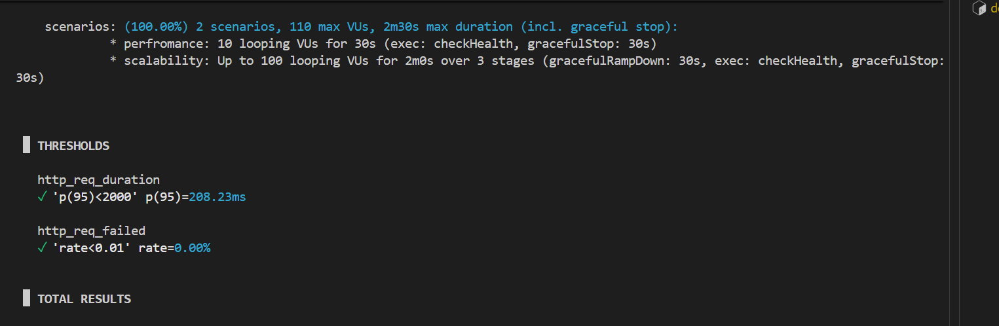
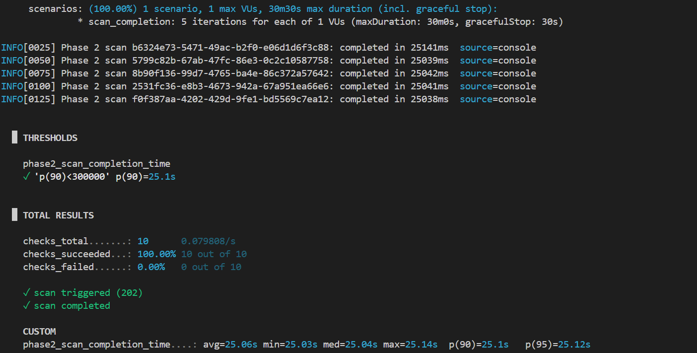
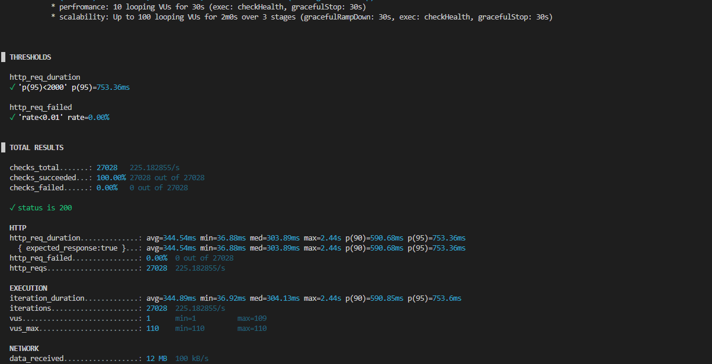
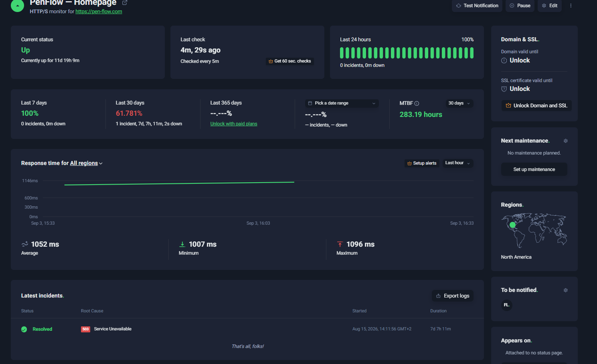
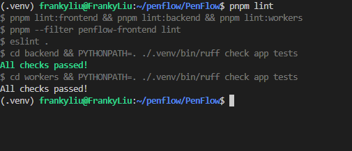
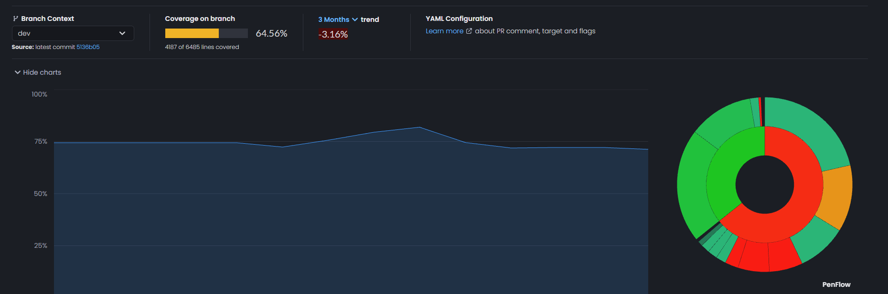
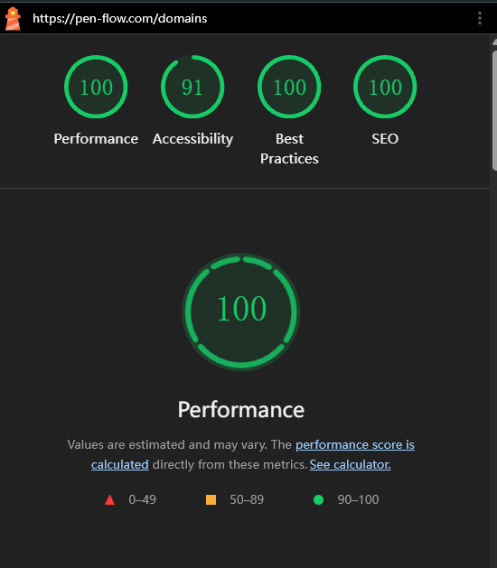

# PenFlow 
# Software Architecture Specification (SAS)

## 1. Architectural Overview

PenFlow is a cybersecurity platform designed to help organisations understand their external attack surface by progressing from passive exposure discovery to active security scanning.

The project was originally developed around passive CTEM (Continuous Threat Exposure Management) principles, where information is gathered from publicly available sources without directly interacting with the target. During Phase 2 the architecture was extended to support active reconnaissance, allowing verified targets to be scanned using a distributed worker pipeline.

The architecture therefore supports two primary operational phases.

- **Phase 1 Passive CTEM**
  - Asynchronous aggregation of multiple OSINT providers.
  - Normalisation of collected intelligence.
  - Exposure discovery without directly interacting with target infrastructure.


- **Phase 2 Active Security Scanning**
  - Target verification and resolution.
  - Active network and web application scanning.
  - Technology fingerprinting.
  - Vulnerability correlation.
  - Normalised Findings and Assets.
  - Backend filtering and reporting.

---

### 1.1 Architectural Objectives

Several architectural goals guided the design of PenFlow throughout both development phases.

The architecture aims to:

- keep the user interface responsive while long-running scans execute
- separate presentation, business logic and persistence responsibilities
- support asynchronous execution of expensive operations
- allow scanning capabilities to evolve independently
- provide a consistent representation of discovered security information
- To reduce the coupling between major system components
- remain maintainable for a small development team

These objectives influenced many of the architectural decisions discussed throughout this specification.

---

### 1.2 Architecture Style: Client–Server + Layered Modular Monolith

At a high level, PenFlow follows a **client–server** architecture:

- **Client:** Next.js web application (Presentation Layer), which is responsible for all our user interactions.
- **Server:** FastAPI backend (Application / Domain Layer), PostgreSQL (Data Layer), asynchronous workers (Integration Layer)

PenFlow is implemented as a **Layered Modular Monolith** (n-tier), in the backend with strong separation of concerns. It is *not* microservices; instead, it is a single deployable system with internal modular boundaries.

The major architectural layers are:

- Presentation Layer
    - Next.js frontend


- Application Layer
    - FastAPI API Gateway
    - routing
    - validation
    - authentication
    - orchestration


- Domain Layer
    - business logic
    - scan lifecycle
    - reporting


- Integration Layer
    - Celery workers
    - RabbitMQ
    - external security tools
    - OSINT providers


- Data Layer
    - PostgreSQL
    - AWS S3

---

### 1.3 Event-Driven / Asynchronous Extension

PenFlow has many Long-running operations (OSINT scans, report generation, and active scans). They are implemented using an **event-driven + asynchronous task processing** model:

When long-running work is required we have: 

- The FastAPI API creates the scan record
- The task is published to RabbitMQ
- Celery workers consume the task
- progress and scan state are persisted to the database while asynchronous workers continue processing in the background
- the frontend receives status updates while processing continues in the background

This hybrid architecture provides responsive UX (fast HTTP responses) while supporting heavy background workflows.

---

### 1.4 Phase 2 Architectural Evolution

Phase 2 represents an architectural extension rather than a redesign.

Instead of introducing one large active scanner, the scanning pipeline was decomposed into a collection of specialised workers responsible for individual scanning responsibilities.

Examples include:

- Target Resolution
- Nmap
- HTTP Security
- TLS Analysis
- Technology Fingerprinting
- CPE Resolution
- CVE Correlation

Each worker performs one clearly defined responsibility before passing its results into the remainder of the pipeline.

This improves maintainability, reduces coupling between scanning components and allows new workers to be introduced with minimal impact on the rest of the architecture.

Every worker produces the same high-level output consisting of:

- Raw Results
- Findings
- Assets
- Status

Because every worker follows the same contract, downstream systems such as persistence, reporting and frontend filtering remain independent from the implementation details of individual workers.

The complete worker architecture is discussed in **Phase2-Worker-Architecture.md**, while the complete lifecycle of scan information is described in **Phase2-Data-Flow.md**.

---

## 2. Architecture Diagrams

This section embeds the core architectural diagrams and explains **what each diagram represents**, **why it matters**, and **how it maps to PenFlow’s runtime behavior**.

### 2.1 High-Level System Architecture


**What this diagram shows**
- The full layered view: **Presentation → API Application Tier → Event Broker Tier → Async Service Tier → Data Tier**, plus external systems.
- The hybrid architecture: synchronous REST + asynchronous scan/report pipelines.

**How it works in PenFlow**
- The Next.js client initiates a scan via REST to FastAPI.
- FastAPI validates input/auth (where applicable), creates scan records, and publishes scan work to RabbitMQ.
- Celery workers consume jobs, call external OSINT providers, normalize results, and persist them.
- Status transitions are written to Redis (and/or DB) and streamed back to the UI.

**Architectural requirements proven**
- Non-blocking scan execution (Performance)
- Fault tolerance through isolation and retries (Reliability)
- Modular monolith boundaries (Maintainability)

---

### 2.2 API Gateway (FastAPI) - Application Tier Detail


**What this diagram shows**
- Internal decomposition of the FastAPI backend into layers/modules: routing/validation, middleware/auth, domain logic, state management, repository/data access.

**How it works in PenFlow**
- Incoming requests go through request validation (Pydantic) and middleware (JWT verification where required).
- Domain logic orchestrates scan creation and task publishing.
- Repository layer isolates database details from orchestration logic.

**Architectural requirements proven**
- Input validation and sanitization (Security)
- Request routing isolation through modular routers (Maintainability)
- Automated API docs via OpenAPI/Swagger (Maintainability/Integrability)

---

### 2.3 Task Orchestration (RabbitMQ + Redis + Workers)


**What this diagram shows**
- The asynchronous workflow: queue consumption, state changes, retry/backoff decisions, normalization, database commits.

**How it works in PenFlow**
- Worker pulls a scan job from RabbitMQ.
- Worker updates scan status to “processing” (DB).
- Worker calls external OSINT APIs.
- If the API fails due to timeout/rate limit, the task is delayed/retried with exponential backoff.
- If successful, data is normalized and committed to PostgreSQL; status becomes “completed.”

**Architectural requirements proven**
- Fault tolerance (Reliability)
- Non-blocking work (Performance)
- Horizontal worker scaling (Scalability)

---

### 2.4 Celery Task Orchestration (Worker Execution Flow)


**What this diagram shows**
- The worker-side orchestration: how Celery tasks are structured and how scan/report tasks can be chained or separated.

**How it works in PenFlow**
- Celery provides routing + retries + durable background execution.
- Workers implement OSINT adapters and normalization logic.
- The system can add more worker containers to increase throughput without touching API capacity.

**Architectural requirements proven**
- Horizontal scalability
- Reliability via retry policies
- Maintainability via isolated adapters

---

### 2.5 Async OSINT Sequence Diagram (CTEM)


**What this diagram shows**
- End-to-end message flow across the system from user interaction to persistent results.

**How it works in PenFlow**
- User starts scan → UI calls API → API persists “pending” scan record → API enqueues scan job → returns 202 quickly.
- Worker pulls job → sets status = “processing” → status is pushed to UI.
- Worker queries external APIs → stores normalized results → sets status = “completed” → UI is notified → results can be retrieved.

**Architectural requirements proven**
- Responsiveness (API returns immediately)
- Real-time progress visibility (UX requirement)
- Clear separation between sync request and async execution

---

### 2.6 Deployment Diagram (Current Hosting Model)


**What this diagram shows**
- Container layout and networking: Next.js, FastAPI, RabbitMQ, Redis, PostgreSQL, workers, and AWS services.

**How it works in PenFlow (Demo 1)**
- Next.js and FastAPI run in separate containers.
- RabbitMQ/Redis/Postgres are internal services in the same network.
- Reports/artifacts are stored in AWS S3; the API controls access.

**Architectural requirements proven**
- Isolation and segregation between components
- Clear runtime boundaries to support scaling
- Cloud storage separation for sensitive artifacts

---

### 2.7 Design Pattern Diagrams - How They Appear in PenFlow

#### Facade Pattern


**How it maps to PenFlow**
- The FastAPI gateway acts as a facade view for the client: it hides queueing, orchestration, retries, normalization, and persistence behind a small set of API endpoints.

#### Adapter Pattern


**How it maps to PenFlow**
- Each OSINT provider integration is an adapter that converts unstable third-party JSON into a stable internal “finding contract.”

#### Observer Pattern


**How it maps to PenFlow**
- State updates propagate from worker execution → Redis/state manager → WebSocket/UI updates. The UI reacts to status changes without polling.

---
### 2.8 Phase 2 Worker Architecture

Demo 2 introduces the first implementation of the Phase 2 worker pipeline.

Rather than implementing a single large security scanner, the architecture follows a pipeline of specialised workers, each responsible for one stage of the scan.

This decision follows the Single Responsibility Principle and improves maintainability by allowing workers to evolve independently.

Each worker produces a standardised output consisting of:

• Raw Results

• Findings

• Assets

• Status

Because every worker follows the same output contract, downstream systems such as reporting and frontend filtering remain independent of worker-specific implementations.

Additional implementation details are documented in Phase2-Worker-Architecture.md.

---

## 3. Deployment Architecture (Demo 2)

### 3.1 Deployment Overview

While Demo 1 focused primarily on the software architecture of PenFlow, Demo 2 introduced the deployment architecture used to host and operate the platform.

PenFlow is deployed using a containerised cloud architecture built on AWS services. The deployment separates application components into independent containers while maintaining a single logical application.

This approach provides several advantages:

- isolation between application components
- simplified deployment and updates
- horizontal scalability
- improved fault tolerance
- easier infrastructure management

The deployment architecture supports both the passive CTEM functionality introduced during Phase 1 and the active security scanning pipeline introduced during Phase 2.

---

### 3.2 Deployment Components

The current deployment architecture consists of the following major components.

| Component | Technology |
| --- | --- |
| Frontend | Next.js |
| Backend | FastAPI |
| Workers | Celery |
| Message Broker | RabbitMQ |
| Database | PostgreSQL (Amazon RDS) |
| Authentication | Keycloak |
| Object Storage | Amazon S3 |
| Containers | Docker |
| Container Hosting | Amazon ECS (Fargate) |
| Container Registry | Amazon ECR |

---

### 3.3 Deployment Characteristics

#### Containerisation

All major application components are packaged as Docker containers.

Containerisation provides a consistent execution environment across development, testing and production environments while simplifying deployment and maintenance.

---

#### Scalability

PenFlow separates the frontend, backend and worker services into independent deployment units.
This allows individual components to scale according to demand without requiring the entire application to scale simultaneously.

For example, additional worker instances can be deployed when scan volume increases without affecting frontend or backend capacity.

---

#### Reliability

The deployment architecture incorporates several mechanisms that improve reliability.

- Application Load Balancer health checks detect unhealthy services.
- Amazon ECS automatically replaces failed containers.
- RabbitMQ provides durable task queues for asynchronous processing.
- PostgreSQL provides persistent storage for application data.

These mechanisms help ensure that failures remain isolated and do not affect the entire platform.

---

#### Security

Several deployment decisions were made to support secure operation of the platform.

- HTTPS/TLS is used for client-server communication.
- Keycloak provides authentication and identity management.
- Secrets are stored using AWS Secrets Manager rather than within source code.
- IAM roles and security groups restrict infrastructure access according to least-privilege principles.
- Sensitive reports and artifacts are stored within Amazon S3.

---

#### Monitoring and Observability

Operational visibility is provided through Amazon CloudWatch.

Logs, metrics and service health information can be monitored to identify failures from there.

---

### 3.4 Relationship to Phase 2

The deployment architecture introduced during Demo 2 directly supports the Phase 2 worker pipeline.

The worker architecture described in **Phase2-Worker-Architecture.md** executes within the Celery worker tier, while the data lifecycle described in **Phase2-Data-Flow.md** is supported through RabbitMQ, PostgreSQL and the backend API.

The deployment architecture therefore acts as the infrastructure foundation upon which the Phase 2 scanning architecture operates.

---

### 3.5 Deployment Environments

PenFlow distinguishes between development and production environments.

| Environment | Infrastructure | Purpose |
| --- | --- | --- |
| Development | Docker Compose / local services | Local development and testing by team members |
| Production | AWS ECS, RDS, Amazon MQ, S3, ECR, ALB, Secrets Manager and CloudWatch | Publicly accessible deployment used for Demo 2 |

The development environment run the PenFlow services locally using Docker Compose, providing equivalent application components without requiring the AWS infrastructure.

The production environments is hosted on AWS and is publicly accessible at:

**https://pen-flow.com**

Authentication is provided through:

**https://auth.pen-flow.com**

The `main` branch is automatically deployed to the production environment after the PenFlow CI completes successfully.

---

### 3.6 Infrastructure as Code and Reproducibility

PenFlow's AWS infrastructure is defined using Terraform. Infrasturcutre definitions are stored within the repository under `infra/`, allowing the required cloud resources to be recreated from a script rather than manual configuration.

The Terraform configuration provides the required networking, ECS services & task definitions, Application Load Balancers, RDS database, Amazon MQ broker, etc.

A bootstrap script is provided to automate initial infrastructure deployment. During bootstrap, the required Docker images are built and pushed to Amazon ECR, the database schema and keycloak database are intialized, and the ECS application services are started.

Environment specific Terraform values are documented using `terraform.tfvars.example`, while sensitive values are supplied seperately and are not stored in version control.


#### Fresh Infrastructure Deployment

1. Clone the repository and configure `infra/terraform.tfvars` from `terraform.tfvars.example`.
2. Configure AWS CLI credentials and the required external API credentials.
3. Run `terraform init`, `terraform validate`, and `terraform plan`.
4. Run `./scripts/bootstrap-infra.sh` with the required database, Keycloak and RabbitMQ passwords.
5. Configure the generated DNS validation/application records.
6. Verify the frontend, backend and authentication health endpoints.

---

### 3.7 Secrets Management

Production runtime secrets, credentials and API keys are all stored in AWS Secrets Manager and supplied to ECS containers at runtime.

GitHub Actions uses GitHub repository secrets for values required by the deployment pipeline. AWS authentication from GitHub Actions uses OpenID Connect (OIDC), allowing the workflow to assume an AWS IAM deployment role with limited permissions without storing AWS access keys in the repository.

---

### 3.8 Continuous Integration and Deployment

PenFlow uses GitHub Actions for continuous integration and automated production deployment.

The CI workflow is triggered by pushes and pull requests targeting the configured development and main branches. The pipeline validates the frontend, backend and worker components through linting, type checking, unit testing and builds.

After these checks succeed, Docker images are built to verify containerisation. Integration tests and Docker health checks then verify communication between application components and supporting services.

A successful CI run associated with a push to the `main` branch triggers the production deployment workflow.

During production deployment:

1. The commit that passed CI is resolved and checked out.
2. GitHub Actions authenticates with AWS using OIDC.
3. Production Docker Images for the frontend, backend and workers are built.
4. Images are tagged using the deployment commit SHA and pushed to Amazon ECR.
5. New ECS task definition revisions are created using the new images.
6. The backend, workers and frontend ECS services are updated sequentially.
7. ECS service stability is verified.
8. Production smoke tests verify the frontend, backend API and Keycloak authentication endpoints.

A failure during any stage of the pipeline will cause the workflow to fail.

---

### 3.9 Deployment Artifacts

The primary production artifacts are Docker container images.

| Artifact | Produced By | Storage / Deployment Target |
| --- | --- | --- |
| Frontend Docker image | Production deployment workflow | Amazon ECR → ECS Frontend Service |
| Backend Docker image | Production deployment workflow | Amazon ECR → ECS Backend Service |
| Worker Docker image | Production deployment workflow | Amazon ECR → ECS Worker Service |
| Test coverage | CI workflows | Codecov |
| PenFlow database schema | Database bootstrap image | Amazon RDS PostgreSQL |
| Generated reports | Backend / workers | Amazon S3 |

Production container images are tagged using the first 12 characters of the Git commit SHA. This provides traceability between deployed artifacts.

---

### 3.10 Rollback Strategy

PenFlow production iamges are tagged using the Git commit SHA rather than relying solely on a mutable `latest` tag. ECS deployments create new task revisions referencing the corresponding image version.

If a deployment introduces a failure, the affected ECS service can be rolled back to its previous task definition revision, which references the previously deployed container image stored in Amazon ECR.

The rollback process therefore consists of:
1. Identify the last known stable ECS task definition revision.
2. Update the affected ECS service to use that revision.
3. Wait for ECS service stability.
4. Re-run the produciton health checks to verify recovery.

Because previous image versions remain available in Amazon ECR, rollback does not require rebuilding the previous application version.

---

### 3.11 Deployment Architecture


Client requests first pass through **Cloudflare DNS**, which manages domain resolution and routes traffic to the **AWS Application Load Balancer (ALB)**.
The Application Load Balancer distributes incoming requests to the appropriate application services hosted within **Amazon ECS**, where the **Next.js frontend** serves the user interface and the **FastAPI backend** processes API requests.
When a user initiates a long-running operation, such as an active vulnerability scan, the backend publishes the task to **RabbitMQ**. One or more **Celery workers** consume these tasks asynchronously, execute the required scanning operations, and persist the results to **Amazon RDS (PostgreSQL)**.
Generated reports and supporting artifacts are stored in **Amazon S3**, while completed scan results are retrieved through the backend and presented to users via the frontend.

The deployment diagram below illustrates these infrastructure components and their relationships.

---

### 3.12 CI/CD Pipeline Diagrams


## 4. Architectural Quality Requirements & Tactics

This section defines the **architecturally significant requirements** and the **tactics** used to achieve them.

--- 


### 4.1 Scalability

**Requirement:**  
PenFlow must handle multiple concurrent scans and multiple concurrent users without degrading the responsiveness of the system, it was designed so we could scale the differing parts independently.
The frontend, backend and Celery worker sections are all deployed as separate components allowing for workers to be added without needing to make changes to the frontend and backend.

**Tactics:**
- **Horizontal scaling of workers:** Celery worker processes/containers scale independently of the API.
- **Queue-based load leveling:** RabbitMQ absorbs bursts of scan requests so the system remains stable during spikes.
- **Stateless API instances (where possible):** Enables scale-out behind a load balancer/API gateway.

**Implications:**  
System throughput scales primarily by increasing worker capacity, not by increasing web server threads.

**Phase2:**
Phase 2 further reinforces this by decomposing scanning into multiple independent workers. Individual workers can be paralleled or replaced without affecting the remainder of the pipeline, allowing future expansion and or additions to our worker frameworks.

---

### 4.2 Performance (Responsiveness)

**Requirement:**  
User-facing operations must remain responsive even when scans are long-running or external services are slow.

**Tactics:**
- **Asynchronous task execution:** Scan logic runs off the request thread (via queue + workers).
- **Fast acknowledgement:** API returns quickly (e.g., 202 Accepted) and provides a scan identifier for tracking.
- **Near real-time progress updates:** UI is updated through event/state streaming (e.g., WebSockets) instead of polling.

**Target behavior (Demo 1):**
- API routes should typically respond within seconds, regardless of scan duration.
- The user should see incremental progress/status transitions for CTEM scans.

---

### 4.3 Reliability & Fault Tolerance

**Requirement:**  
PenFlow must continue producing usable results even when OSINT sources are unavailable, rate-limited, or intermittent.
If workers fail, they remain isolated from the API through our task queue, this prevents any singular failing worker from harming the reliability of the rest of the pipeline.

**Tactics:**
- **Partial failure tolerance:** Individual OSINT adapter failures do not fail the entire scan.
- **Retry:** Worker tasks retry transient failures without cascading errors.
- **Timeouts and bounded calls:** External calls are bounded to prevent stuck scans.
- **Durable messaging:** RabbitMQ holds tasks until successfully consumed.

**Result:**  
PenFlow produces a “best-effort” report instead of failing hard due to a single upstream provider, The philosophy we used for PenFlow is to accept any usable data over no data at all from any given scan.

---

### 4.4 Maintainability & Evolvability

**Requirement:**  
PenFlow must support frequent change: adding/removing OSINT providers, adjusting normalized data structures, and refining report content without breaking the system.

**Tactics:**
- **Modular monolith boundaries:** Distinct modules (API/router layer, domain logic, adapters, persistence).
- **High cohesion / low coupling:** OSINT adapters are isolated behind stable interfaces/contracts.
- **Contract-based normalization:** Third-party output is mapped into a stable internal “finding contract.”
- **Strong typing + validation:** Pydantic models and mypy enforce early error detection.
- **Consistent quality gates:** Linting/formatting/testing in CI reduces long-term drift and regression risk.
- **Standardised Outputs:** Standardised worker output further improves maintainability by ensuring that all downstream components consume a common data structure

---

### 4.5 Security (Core Requirement)

**Requirement:**  
PenFlow processes sensitive vulnerability and exposure data. The system must protect tenant data, credentials, and generated reports.

**Tactics:**
- **Authentication & Authorization:** JWT-based auth (Keycloak) with role-based access control (RBAC).
- **Ownership-scoped access control:** Resource lookups (scans, domains) are scoped by the requesting user's ID; a request for another user's resource returns 404 rather than exposing that the resource exists.
- **IP-based rate limiting:** Scan submission is capped per source IP (e.g. 3 scan requests per 10 minutes) to prevent abuse of external OSINT/active-scan providers.
- **Information hiding:** External API keys and internal scanning logic are not exposed to the client.
- **Transport security:** HTTPS/TLS for all client-server communication.
- **Least privilege (AWS IAM):** Roles/policies scoped to minimum required access.
- **Secure file delivery:** Reports stored in S3; access via controlled mechanisms (e.g., presigned URLs).

As a cybersecurity platform, security forms a fundamental part of our architectural requirement.
Authentication is handled through: 
- **Keycloak**
- **HTTPS/TLS**
- **AWS Secrets Manager**

Both Keycloak and The HTTPS/TLS protocols are our way of ensuring a safe environment while AWS Secrets manager is our way of ensure the safety of information outside our internal system.
Infrastructure components are further protected using IAM roles and security groups, while generated reports and other persistent artifacts are stored within Amazon S3.
These architectural decisions help protect both application infrastructure and user data.


---

### 4.7 Observability (Operational Quality)

**Requirement:**  
The team must be able to debug scan failures and verify progress across asynchronous boundaries.

**Tactics:**
- **Centralized structured logging:** Correlate request IDs with scan IDs and Celery task IDs.
- **Audit-friendly scan state model:** Record state transitions consistently.
- **Metrics readiness:** Queue depth, task runtime, failure rate, retries.

---

### 4.8 Quality Requirement Mapping

The following table summarises how the architectural decisions made throughout PenFlow support the quality requirements identified in the Software Requirements Specification.

| Quality Requirement | Architectural Decision                                                                                                                                                                                                                                  |
|---------------------|---------------------------------------------------------------------------------------------------------------------------------------------------------------------------------------------------------------------------------------------------------|
| Performance | Long-running scans are executed asynchronously using RabbitMQ and Celery workers, allowing the FastAPI backend to respond immediately while scan processing continues in the background.                                                                |
| Reliability | RabbitMQ provides durable task queues while Celery supports retry mechanisms for failures. Worker failures are isolated from the API, allowing scans to finish with partial results where possible. Independent ECS deployment with Application Load Balancer health checks and automatic container replacement further protects service availability (see §3.3).                                                    |
| Scalability | The frontend, backend and worker services are deployed as independent components. Additional worker instances can be introduced without affecting the remainder of the application, while RabbitMQ buffers scan requests during periods of high demand. |
| Security | Keycloak provides authentication and identity management, HTTPS/TLS secures client communication, AWS Secrets Manager protects sensitive credentials, and IAM roles restrict infrastructure access according to least-privilege principles. Resource lookups are additionally scoped by the requesting user's ID, and scan submission is rate-limited per source IP.             |
| Maintainability | PenFlow follows a layered modular architecture and decomposes Phase 2 scanning into specialised workers that communicate through a common data contract, allowing new scanning capabilities to be introduced with minimal architectural changes. Consistent linting, formatting and test coverage gates in CI reduce long-term drift and regression risk.       |
---

## 5. Architectural Patterns

PenFlow combines several architectural patterns to satisfy the functional and quality requirements within our project.
Rather than relying on a single architectural style, the system combines a layered modular monolith with asynchronous event-driven processing. 

Together these patterns provide:
- **Separation of Concerns**
- **Maintainability**
- **Scalability**
- **Support for long-running scanning operations**

The following sections describe the primary architectural patterns adopted throughout the platform.

### 5.1 Layered Architecture (n-tier)

PenFlow is structured as primarily a layered monolith:
Our Responsibilities are mainly separated into 5 distinct layers:

- **Presentation Layer:** Next.js Frontend responsible for all user interactions.
- **Application Layer (API Gateway):** FastAPI routers, validation, auth, orchestration
- **Domain Layer:** business logic for scan lifecycles, OSINT logic and reporting and vulnerability processing.
- **Integration Layer:** Celery workers, RabbitMQ orchestrator and OSINT providers.
- **Data Layer:** PostgreSQL for persistent storage in our DB, Amazon S3 for report and artifact storage for client and business use.

Our layered approach allows us to modify and change workers independently without disrupting the standardised output and flow we have designed.

---

### 5.2 Event-Driven Architecture
Long-Running scans are developed using the premise of an event-driven architecture
Our data flow is orchestrated so the backend publishes scans to RabbitMQ that are then consumed by the Celery Workers.

The typical workflow looks like this:

- **ScanRequested** - published by FastAPI
- **WorkerStarted** - Celery worker begins processing
- **WorkerCompleted** - findings persisted
- **ScanCompleted** - frontend updated

---

### 5.3 Repository Pattern (Data Access Isolation)

PenFlow separates persistence logic from business logic through the Repository Pattern.
Database operations are encapsulated within repository classes responsible for interacting with PostgreSQL, Thus workers dont need to directly write to the DB and the backend can take the responsibility for the action.

This provides several benefits:

- **Reduced coupling between business logic and persistence**
- **Simplified testing**
- **Easier database maintenance**
- **Improved code reuse**

The repository abstraction also ensures that our future database changes will have minimal impact on higher application layers.

---

### 5.4 Worker Pipeline Architecture (Phase 2)

The Phase 2 vulnerability scanning system follows a pipeline architecture built around specialised scanning workers.
Rather than implementing one monolithic vulnerability scanner, the scanning process is separated into multiple  async workers.

The Pipeline stages include:

- **Target Resolution**
- **Nmap ports and services enumeration**
- **HTTP Security Analysis**
- **TLS Analysis**
- **Technology Fingerprinting**
- **CPE Resolution**
- **CVE Correlation**

Each worker consumes the output produced by previous stages before generating a standardised result consisting of:

- **Raw Results**
- **Findings**
- **Assets**
- **Status**

Because every worker follows the same data contract, With this we can add many more workers without needing to change other backend/ frontend related architecture.
This pipeline architecture significantly improves extensibility and our scalability.

---

## 6. Design Patterns

PenFlow makes use of design patterns to improve our modularity and maintainability. These patterns help us add new features while not having to change much of the architecture to do it.

## 6.1 Facade Pattern

- **Facade:** FastAPI gateway hides subsystem complexity so as to not expose it to the frontend user interface. The gateway coordinates the underlying components on the users behalf.

---

## 6.2 Adapter Pattern

- **Adapter:** We employ multiple OSINT providers and security tools, each of whichs results are normalized to confirm with a set data contract.

---

## 6.3 Observer Pattern

- **Observer:** real-time state updates to show progress to users. As the workers are executed, their various stages are sent to the frontend, allowing for the users to efficiently monitor progress.

---

## 6.4 Repository Pattern

- **Repository:** DB access is encapsulated within repository classes to isolate the persistence and business logic sections from one another.
- The repo pattern also allowed us to provide an interface for storing the data in our subsequent sections; findings, assets, assets and reports while hiding the direct db access.

---

## 6.5 Pipes and Filter pattern (Phase 2)

**Pipeline:** The phase 2 workers follow a pipeline where the scan is broken into a sequence of specialised workers responsible for their individual fields. 

- **Target Resolution**
- **Port Scanning**
- **HTTP security scanning**
- **TLS analysis**
- **Tech stack fingerprinting**
- **Cpe generation**
- **CVE correlations**

By standardising outputs into our common fields(findings, assets , etc..)New scanning stages can be introduced without much impact to the rest of the pipeline.

---

## 7. Architecture Constraints

The following constraints influenced our design and way of implementing the PenFlow architecture.

### 7.1 Technology Constraints

The project architecture is constrained by these technologies.

- The backend is implemented using **FastAPI**.
- The frontend is implemented using **Next.js**.
- Background processing is implemented using **Celery workers**.
- **RabbitMQ** is used as the message broker for asynchronous task execution.
- **PostgreSQL** is used as the relational database.
- **Docker containers** are used to provide consistent execution environments.

---

### 7.2 External Provider Constraints

PenFlow relies on numerous third-party services and public data sources:
- **Shodan**
- **Hunter.io**
- **HaveIBeenPwned**
- **crt.sh**
- **Wappalyzer**
- **CVE NVD queries**

With these services the following constraints were introduced:
- **API rate Limiting**
- **Service Availability**
- **Response time**
- **Response Reliability**
- **Differing Response Formats**

---

### 7.3 Regulatory / Ethical Constraints

- Phase 1 scans remain passive (OSINT-only).
- Phase 2 Introduced Domain Verification and more direct scans which could be deemed invasive, For navigating this we needed to endure we properly rate limited so as to not ddos Domains by accident.

---

### 7.4 Operational Constraints

- Architecture must remain manageable for a small team (modular monolith, clear boundaries).

---

### 7.5 Worker Pipeline Constraints (Phase 2)

The Phase 2 scanning architecture follows a fixed processing pipeline.
Certain workers depend on information produced by earlier stages of the scan. For Example the Cpe resolver and CVE queries only work if we in the fingerprinting section come up with a technology used and or version.
As a result, worker execution must respect the logical ordering of the pipeline while maintaining the standardised Findings and Assets data contract between each of our workers.

---

### 7.6 Deployment Constraints

The production deployment targets a containerised cloud environment.
Application components are deployed as Docker containers hosted within AWS servers, with RabbitMQ, PostgreSQL and supporting services.
The architecture thus assumes reliable communication between distributed containers.

---

### 7.7 Team Constraints

PenFlow was developed by a small student development team within fixed academic deadlines, Those being various demo timelines separated through the academic year.
To reduce implementation complexity and simplify maintenance, the project adopts a layered modular monolith rather than a microservices architecture while still supporting asynchronous background processing through specialised workers, This was all in the aid of having members work on sections individually to produce workable units we later integrated together as a team

---

## 8. Architectural Responsibilities

| Component | Architectural Responsibility                                                                                                                                                 |
|-----------|------------------------------------------------------------------------------------------------------------------------------------------------------------------------------|
| **Next.js Frontend** | Provides the user interface, initiates scans, displays scan progress, presents findings, reports and historical scan data and acts as a lohin/singup medium.                 |
| **FastAPI Backend** | Exposes the REST API, validates requests, manages authentication and authorisation, orchestrates scan workflows, persists application data and coordinates worker execution. |
| **RabbitMQ** | Provides asynchronous message delivery between the backend and worker services, enabling long-running tasks to execute independently of user requests.                       |
| **Celery Workers** | Execute asynchronous scanning tasks, perform security analysis, normalise results and produce the standard Findings and Assets data contract.                                |
| **PostgreSQL** | Serves as the primary persistent data store for users, scans, findings, assets, reports and audit information.                                                               |
| **Keycloak** | Manages user authentication, identity management and access control.                                                                                                         |
| **Amazon S3** | Stores generated reports and other application artefacts for secure retrieval.                                                                                               |
| **Docker & Amazon ECS** | Provide container orchestration and runtime environments for deploying and scaling application components.                                                                   |

---

## 9. Technology Stack

The technologies selected for PenFlow were chosen to support the architectural objectives described throughout this specification.

| Technology | Architectural Role |
|------------|--------------------|
| **Next.js** | Implements the presentation layer and provides the web-based user interface. |
| **FastAPI** | Implements the application layer, exposing REST APIs and coordinating business logic. |
| **Celery** | Executes asynchronous background tasks, enabling long-running scans without blocking user requests. |
| **RabbitMQ** | Provides reliable message-based communication between the backend and worker services. |
| **PostgreSQL** | Stores persistent application data, including scans, findings, assets and user information. |
| **Keycloak** | Provides authentication, identity management and role-based access control. |
| **Amazon S3** | Stores generated reports and other persistent artefacts. |
| **Docker** | Packages application components into portable, reproducible execution environments. |
| **Amazon ECS (Fargate)** | Hosts and manages containerised application services in the production environment. |
| **Amazon ECR** | Stores container images used during deployment. |
| **Cloudflare DNS** | Provides domain management and request routing to the deployed application. |
| **AWS Application Load Balancer** | Distributes incoming requests across application services and performs health checks. |

---

---

## 10. Supporting Architecture Documents

The Software Architecture Specification provides the high-level architectural decisions that guide the design of PenFlow.

The following supporting documents provide additional detail for the Phase 2 architecture introduced during Demo 2.

| Document                                                                        | Purpose                                                                                                                                                      |
|---------------------------------------------------------------------------------|--------------------------------------------------------------------------------------------------------------------------------------------------------------|
| [Phase 2 Worker Architecture](/docs/Architecture/phase2-worker-architecture.md) | Describes the worker pipeline, worker responsibilities, the standard worker contract, and architectural rationale for the distributed scanning architecture. |
| [Phase 2 Data Flow](/docs/Architecture/phase2-data-flow.md)                     | Describes how scan information flows through the backend, workers, Findings, Assets and reporting pipeline.                                                  |


---

## Service Contracts

PenFlow exposes REST APIs between the frontend, backend and worker services. The contracts below document the main communication boundaries used by the system.

Each contract gives the endpoint, required inputs, authentication, expected response and possible errors. Full request and response schemas are also available through PenFlow's generated OpenAPI/Swagger documentation.

---

### 1: Domain Verification Service

The Domain Verification Service allows users to register, verify, list and remove domains.

#### 1.1: Add Domain for Verification

`POST /api/v1/domains/`

Registers a domain to the authenticated user and generates the information needed for DNS verification.

**Auth:** Required.

**Input:** `domain` (string)

```json
{
    "domain": "hackerone.com"
}
```

**201 Created:** Returns `VerifiedDomainResponse` containing `id`, `domain`, `status`, `verification_token` and `verified_at`.

Example token: `penflow-verification=pentoken123...`

**Errors:** 

- `401` user not found, 
- `409` domain already registered, 
- `422` invalid domain or request.

---

#### 1.2: Verify Domain Ownership

`POST /api/v1/domains/{domain_id}/verify`

Checks the domain's DNS TXT records for the generated verification token.

**Auth:** Required. Users may only verify their own domains.

**Input:** `domain_id` (UUID path parameter)

**Rate Limit:** 10 requests per minute per client IP.

**200 OK:** Returns the updated `VerifiedDomainResponse`. If already verified, the existing verified record is returned.

**Errors:** 
- `400` DNS verification failed, 
- `401` user not found, 
- `404` domain not found, 
- `422` invalid domain ID.

---

#### 1.3: List Registered Domains

`GET /api/v1/domains`

Returns domains belonging to the authenticated user.

**Auth:** Required.

**Query:** `status`, `search`, `sort` (`domain`, `created_at`, `status`), `order` (`asc`, `desc`), `limit` (1-100, default 20), `offset` (default 0).

**200 OK:** Returns `DomainList` containing domain items, verification status counts and pagination information.

**Errors:** 
- `401` user not found, 
- `422` invalid query values.

---

#### 1.4: Delete Registered Domain

`DELETE /api/v1/domains/{domain_id}`

Deletes a domain verification record belonging to the authenticated user.

**Auth:** Required.

**Input:** `domain_id` (UUID path parameter)

**204 No Content:** Domain deleted successfully.

**Errors:** 
- `401` user not found, 
- `404` domain not found, 
- `422` invalid domain ID.

---

### 2: System Health Service

The System Health Service checks the API and database connection.

#### 2.1: Get System Health

`GET /api/v1/health`

Checks whether the PenFlow API is running and whether the backend can connect to the database.

**Auth:** Not required.

**200 OK:** Returns `status`, `api_version` and `database`.

```json
{
    "status": "ok",
    "api_version": "1.0.0",
    "database": "connected"
}
```

`database` is either `connected` or `disconnected`. A database failure is logged but the endpoint still returns `200 OK`.

---

### 3: User Service

The User Service links the authenticated Keycloak identity to a PenFlow user.

#### 3.1: Get Current User

`GET /api/v1/users/me`

Returns the PenFlow user linked to the current Keycloak identity. If no user exists, a new `client` user is created. Existing user email and name information is updated from Keycloak.

**Auth:** Required.

**200 OK:** Returns `id`, `email` and `role`.

```json
{
    "id": "2ec29dfa-6839-43ba-a45a-32a31f25dbdb",
    "email": "user@usermail.com",
    "role": "client"
}
```

**Errors:** `500` user could not be retrieved or created.

---

### 4: Scan Service

The Scan Service manages Phase 1 passive CTEM scans and Phase 2 active vulnerability scans.

#### 4.1: Initiate Scan

`POST /api/v1/scans/`

Starts a passive CTEM or active vulnerability scan and queues the relevant Celery pipeline.

**Auth:** Optional for passive scans. Required for active scans.

**Input:** `domain`, `scan_type`, optional `verified_domain_id`, optional `email`.

```json
{
    "domain": "hackerone.com",
    "scan_type": "passive_ctem",
    "verified_domain_id": null,
    "email": "steve@penflow.com"
}
```

`scan_type` is either `passive_ctem` or `active_vulnerability`.

Active scans require an authenticated user, a verified domain ID and a domain matching the verification record.

**Rate Limit:** 3 scan requests per 10 minutes per client IP.

**202 Accepted:** Returns `scan_id` and initial status `queued`.

**Errors:** 
- `400` active scan details invalid, 
- `401` authentication required, 
- `403` domain not verified, 
- `422` invalid request, 
- `500` scan could not be started.

---

#### 4.2: List Scans

`GET /api/v1/scans/`

Returns the authenticated user's scan history, newest first.

**Auth:** Required.

**Query:** optional `scan_status`, `limit` (1-100, default 10), `offset` (default 0).

Scan statuses: `queued`, `running`, `completed`, `failed`, `partial`.

**200 OK:** Returns scan history containing scan ID, domain, date, type, status, progress and finding counts.

**Errors:** 
- `404` user not found, 
- `422` invalid query values, 
- `500` history could not be retrieved.

---

#### 4.3: Get Scan Status

`GET /api/v1/scans/{scan_id}/status`

Returns the current scan status, progress, source statuses and report status.

**Auth:** Optional. Anonymous scans may be checked without authentication. User owned scans require the matching user.

**Input:** `scan_id` (UUID path parameter)

**200 OK:** Returns `scan_id`, `domain`, `created_at`, `scan_type`, `status`, `progress`, `sources` and `report_status`.

Sources that have not returned a result are shown as `pending`.

**Errors:** 
- `404` scan not found or user does not own the scan, 
- `422` invalid scan ID.

---

#### 4.4: Get Scan Summary

`GET /api/v1/scans/{scan_id}/summary`

Returns the main summary information for a scan.

**Auth:** Not required.

**Input:** `scan_id` (UUID path parameter)

**200 OK:** Returns the scan summary, severity counts, top findings, asset impact, source coverage and report status.

Up to five top findings are returned in the preview.

**Errors:** 
- `404` scan not found, 
- `422` invalid scan ID.

---

#### 4.5: Get Scan Metrics

`GET /api/v1/scans/{scan_id}/metrics`

Returns the calculated risk score and scan metrics.

**Auth:** Not required.

**Input:** `scan_id` (UUID path parameter)

**200 OK:** Returns `risk_score`, `risk_level`, finding counts, asset counts, service counts and technology counts.

Risk weighting:
- Critical: 25
- High: 15
- Medium: 5
- Low: 1

Risk levels are `HIGH RISK` from 70, `MEDIUM RISK` from 40 and `LOW RISK` below 40.

**Errors:** 
- `404` scan not found, 
- `422` invalid scan ID.

---

#### 4.6: Get Scan Findings

`GET /api/v1/scans/{scan_id}/findings`

Returns findings produced by a scan.

**Auth:** Not required.

**Input:** `scan_id` (UUID path parameter)

**Query:** optional `severity`, `limit` (1-100, default 10), `offset` (default 0).

**200 OK:** Returns findings containing ID, title, CVE, severity, CVSS score, source, asset, description and recommendation. Results are newest first.

**Errors:** `422` invalid scan ID or pagination values.

---

#### 4.7: Get Scan Assets

`GET /api/v1/scans/{scan_id}/assets`

Returns assets discovered during a scan.

**Auth:** Not required.

**Input:** `scan_id` (UUID path parameter)

**Query:** `limit` (1-100, default 10), `offset` (default 0).

**200 OK:** Returns asset ID, identifier, asset type and finding count. Assets with the most findings are returned first.

**Errors:** `422` invalid scan ID or pagination values.

---

#### 4.8: Get Findings Page

`GET /api/v1/scans/{scan_id}/findings-page`

Returns the expanded findings data used by the Findings page.

**Auth:** Not required.

**Input:** `scan_id` (UUID path parameter)

**Query:** optional `severity`, `search`, `sort_by`, `limit` (default 12), `offset` (default 0).

`low_info` combines Low and Informational findings. `sort_by` supports severity and CVSS sorting.

**200 OK:** Returns `total`, severity `counts` and finding `items`.

**Errors:** `422` invalid scan ID, filter or pagination values.

---

#### 4.9: Get Assets Page

`GET /api/v1/scans/{scan_id}/assets-page`

Returns the expanded asset data used by the Assets page.

**Auth:** Not required.

**Input:** `scan_id` (UUID path parameter)

**Query:** optional `asset_type`, `severity`, `search`, `sort_by`, `limit` (default 15), `offset` (default 0).

**200 OK:** Returns `total`, asset category `counts` and asset `items` including severity and finding counts.

**Errors:** `422` invalid scan ID or pagination values.

---

#### 4.10: Get Services Page

`GET /api/v1/scans/{scan_id}/services-page`

Returns network services discovered during a scan.

**Auth:** Not required.

**Input:** `scan_id` (UUID path parameter)

**Query:** optional `protocol`, `search`, `sort_by`, `limit` (default 15), `offset` (default 0).

**200 OK:** Returns `total`, protocol/state `counts` and service `items` including host, port, protocol, product, version, state and risk level.

**Errors:** `422` invalid scan ID or pagination values.

---

#### 4.11: Get Risk History

`GET /api/v1/scans/{scan_id}/risk-history`

Returns risk history from completed scans of the same domain.

**Auth:** Not required.

**Input:** `scan_id` (UUID path parameter)

**200 OK:** Returns up to 10 completed scans containing `date`, `risk_score` and `total_findings`, ordered from oldest to newest.

If no history exists, an empty list is returned.

**Errors:** `422` invalid scan ID.

---

### 5: Scan Report Service

The Scan Report Service allows scan reports to be downloaded or emailed.

#### 5.1: Download Scan PDF

`GET /api/v1/scans/{scan_id}/pdf`

Downloads the completed PDF report for a scan.

**Auth:** Not required.

**Input:** `scan_id` (UUID path parameter)

**200 OK:** Returns the generated PDF as `PenFlow_Report_{scan_id}.pdf`. Reports may be retrieved from local storage or Amazon S3.

**Errors:** 
- `400` report is not ready, 
- `404` report does not exist or cannot be retrieved, 
- `422` invalid scan ID.

---

#### 5.2: Email Scan Report

`POST /api/v1/scans/{scan_id}/email-report`

Emails a completed scan report as a PDF attachment.

**Auth:** Not required.

**Input:** `scan_id` (UUID path parameter), `email` (email address).

```json
{
    "email": "steve@penflow.com"
}
```

**Rate Limit:** 2 requests per minute per client IP.

**200 OK:**

```json
{
    "message": "Report emailed successfully"
}
```

**Errors:** 
- `400` report is not ready, 
- `404` scan not found, 
- `422` invalid scan ID or email.

---

### 6: Internal Worker Service

The Internal Worker Service allows workers to send scan, source and report updates back to the backend.

#### 6.1: Update Scan Status

`PATCH /api/v1/internal/scans/{scan_id}/status`

Updates the overall status of a scan.

**Auth:** Not required.

**Input:** `scan_id` (UUID), `status`, optional `error_message`.

```json
{
    "status": "completed",
    "error_message": null
}
```

Scan statuses: `queued`, `running`, `completed`, `failed`, `partial`.

A completed scan is set to 100% progress. `completed` and `partial` scans also start report generation.

**200 OK:** Returns `scan_id`, `status` and `report_status`.

**Errors:** 
- `404` scan not found, 
- `422` invalid scan ID or status, 
- `500` callback failed.

---

#### 6.2: Submit Scan Source Result

`PATCH /api/v1/internal/scans/{scan_id}/sources/{source_name}`

Stores the result returned by an individual scan worker and updates scan progress.

**Auth:** Not required.

**Input:** `scan_id` (UUID), `source_name`, `status`, optional `raw_result`, `assets`, `services`, `technologies`, `findings` and `error_message`.

Example:

```json
{
    "status": "completed",
    "raw_result": {
        "checked": true
    },
    "assets": [
        {
            "identifier": "hackerone.com",
            "asset_type": "domain"
        }
    ],
    "services": [],
    "technologies": [],
    "findings": [],
    "error_message": null
}
```

Source statuses: `pending`, `running`, `completed`, `failed`, `partial`, `skipped`.

When all expected sources finish, the scan becomes `completed`, `failed` or `partial`. Completed and partial scans may also start report generation.

**200 OK:** Returns `scan_id`, `source_name`, `scan_status`, `progress` and `report_status`.

**Errors:** 
- `404` scan not found, 
- `422` invalid scan ID, 
- `500` source callback failed.

---

#### 6.3: Update Report Status

`PATCH /api/v1/internal/reports/{scan_id}/status`

Updates a report after the report worker completes or fails.

**Auth:** Not required.

**Input:** `scan_id` (UUID), `status`, optional `pdf_path`, optional `error_message`.

`status` must be `completed` or `failed`. A completed report requires `pdf_path`.

Example:

```json
{
    "status": "completed",
    "pdf_path": "scans/2ec29dfa-6839-43ba-a45a-32a31f25dbdb/report.pdf",
    "error_message": null
}
```

**200 OK:** Returns `scan_id` and `report_status`.

**Errors:** 
- `400` invalid report status or missing PDF path, 
- `422` invalid scan ID, 
- `500` callback failed.

---

### 7: Notification Service

The Notification Service allows authenticated users to view and manage their notifications.

#### 7.1: List Notifications

`GET /api/v1/notifications`

Returns notifications belonging to the authenticated user, newest first.

**Auth:** Required.

**Query:** `unread_only` (default `false`), `limit` (1-100, default 20), `offset` (default 0).

**200 OK:** Returns notification `items`, the user's `unread_count` and pagination information.

Each notification contains `id`, `type`, `title`, `message`, `is_read`, `read_at`, optional `engagement_id`, `metadata` and `created_at`.

If `unread_only=true`, only unread notifications are returned.

**Errors:** `422` invalid query values.

---

#### 7.2: Mark Notification as Read

`PATCH /api/v1/notifications/{notification_id}/read`

Marks one notification belonging to the authenticated user as read.

**Auth:** Required.

**Input:** `notification_id` (UUID path parameter)

**200 OK:** Returns the updated notification. `is_read` is set to `true` and `read_at` is recorded when the notification is first marked as read.

**Errors:** 
- `404` notification not found or does not belong to the user, 
- `422` invalid notification ID.

---

#### 7.3: Mark All Notifications as Read

`PATCH /api/v1/notifications/read-all`

Marks all unread notifications belonging to the authenticated user as read.

**Auth:** Required.

**200 OK:** Returns the number of notifications that were changed.

```json
{
    "marked_read": 3
}
```

If there are no unread notifications, `marked_read` is `0`.

--- 

### 8: Engagement and Messaging Service

The Engagement Service handles engagement requests, engagement details, messages and activity.

#### 8.1: Create Engagement

`POST /api/v1/engagements/`

Creates a new engagement request for the authenticated user.

**Auth:** Required.

**Input:** `engagement_type`, `assessment_type`, `objective`, optional dates, optional constraints, optional primary contact and at least one asset.

```json
{
    "engagement_type": "black_box",
    "assessment_type": "web_application",
    "objective": "Test hackerone.com for web vulnerabilities",
    "start_date": "2026-09-10",
    "end_date": "2026-09-12",
    "primary_contact": "steve@penflow.com",
    "assets": [
        {
            "type": "domain",
            "value": "hackerone.com"
        }
    ]
}
```

Asset types are `domain`, `ip`, `hostname` and `url`.

**201 Created:** Returns the engagement ID, initial status, engagement and assessment types, objective, dates, asset count, estimated quote and assignment information.

New engagements start with the `requested` status.

**Errors:** 
- `401` user not found, 
- `422` invalid request, asset or date range.

---

#### 8.2: List Engagements

`GET /api/v1/engagements`

Returns engagements linked to the authenticated user.

**Auth:** Required.

**Query:** optional `status`, `search`, `sort`, `order`, `limit` (1-100, default 20), `offset` (default 0).

`sort` supports `created_at`, `updated_at`, `client`, `status` and `requested_start_date`. Default sorting is `updated_at` descending.

**200 OK:** Returns engagement `items`, status `counts` and pagination information.

Each item includes the engagement ID, title, type, assessment type, priority, status, client, asset count, dates, estimated quote and assigned pentester where available.

**Errors:** 
- `401` user not found, 
- `422` invalid query values.

---

#### 8.3: Get Engagement

`GET /api/v1/engagements/{engagement_id}`

Returns the full details for an engagement.

**Auth:** Required. Access is limited to the client, assigned pentester, Service Delivery user or admin linked to the engagement.

**Input:** `engagement_id` (UUID path parameter)

**200 OK:** Returns engagement details including status, scope, dates, quote, users, assets, finding counts, recent findings and previous scan information where available.

**Errors:** `401` user not found, `404` engagement not found or not accessible, `422` invalid engagement ID, `500` engagement client could not be loaded.

---

#### 8.4: List Engagement Messages

`GET /api/v1/engagements/{engagement_id}/messages`

Returns messages for a selected engagement conversation.

**Auth:** Required. The user must be part of the selected message channel.

**Input:** `engagement_id` (UUID path parameter)

**Query:** `channel`

Supported channels are:
- `client_service_delivery`
- `service_delivery_pentester`

**200 OK:** Returns message items containing sender, recipient, channel, message, read state, optional finding ID and creation time. Messages are returned oldest first.

**Errors:** 
- `401` user not found, 
- `404` engagement or conversation not accessible, 
- `422` invalid engagement ID or channel.

---

#### 8.5: Send Engagement Message

`POST /api/v1/engagements/{engagement_id}/messages`

Sends a message through one of the engagement communication channels.

**Auth:** Required. The sender must be part of the selected channel.

**Input:** `engagement_id` (UUID), `comment`, `channel` and optional `finding_id`.

```json
{
    "comment": "Can you confirm whether this finding should be included in the final report?",
    "channel": "service_delivery_pentester",
    "finding_id": null
}
```

**201 Created:** Returns the created message including sender, recipient, channel, read state and creation time.

**Errors:** 
- `404` conversation not accessible, 
- `409` the other participant has not been assigned, 
- `422` empty message, invalid channel or finding does not belong to the engagement, 
- `500` message participant could not be loaded.

---

#### 8.6: Mark Engagement Messages as Read

`PATCH /api/v1/engagements/{engagement_id}/messages/read`

Marks unread messages in a selected engagement conversation as read.

**Auth:** Required. The user must be part of the selected channel.

**Input:** `engagement_id` (UUID path parameter)

**Query:** `channel`

**200 OK:** Returns the number of messages changed.

```json
{
    "marked_read": 4
}
```

**Errors:** 
- `401` user not found, 
- `404` conversation not accessible, 
- `422` invalid engagement ID or channel.

---

#### 8.7: Get Engagement Activity

`GET /api/v1/engagements/{engagement_id}/activity`

Returns activity recorded for an engagement and its related entities.

**Auth:** Required. The user must have access to the engagement.

**Input:** `engagement_id` (UUID path parameter)

**Query:** `limit` (1-200, default 100).

**200 OK:** Returns activity items containing `action`, `entity_type`, optional `entity_id`, actor, metadata and creation time.

**Errors:** 
- `401` user not found, 
- `404` engagement not found or not accessible, 
- `422` invalid engagement ID or limit.

---

### 9: Findings and Evidence Service

The Findings Service allows engagement findings to be viewed, updated, verified, deleted and supported with evidence.

#### 9.1: Get Finding

`GET /api/v1/findings/{finding_id}`

Returns the details of a finding.

**Auth:** Required. The finding must belong to an engagement assigned to the user.

**Input:** `finding_id` (UUID path parameter)

**200 OK:** Returns the finding including severity, status, CVSS score, CVE, description, recommendation, asset information and uploaded evidence.

**Errors:** 
- `401` user not found, 
- `404` finding not found or not accessible, 
- `422` invalid finding ID.

---

#### 9.2: Update Finding

`PATCH /api/v1/findings/{finding_id}`

Updates an engagement finding.

**Auth:** Pentester required. The finding must belong to an engagement assigned to the pentester.

**Input:** `finding_id` (UUID) and `FindingUpdate`.

Editable fields include title, engagement asset, severity, CVSS score, CVE ID, description, recommendation, status and verification state.

Findings can only be edited while the engagement is `in_progress`.

**200 OK:** Returns the updated finding.

**Errors:** 
- `404` finding not found or not accessible, 
- `409` engagement is not in progress or a verified finding is being marked as a false positive, 
- `422` invalid request or selected asset does not belong to the engagement.

---

#### 9.3: Upload Finding Evidence

`POST /api/v1/findings/{finding_id}/evidence`

Uploads an evidence file for a finding.

**Auth:** Pentester required. The finding must belong to an active engagement assigned to the pentester.

**Input:** `finding_id` (UUID) and one uploaded file.

Maximum file size is 10 MB.

Supported file types:
- PNG
- JPEG
- TXT
- JSON
- PDF

The backend checks the actual file type and validates image and JSON contents.

**201 Created:** Returns the evidence ID, file name, MIME type and upload time.

**Errors:** 
- `404` finding not found, 
- `409` engagement is not in progress, 
- `413` file exceeds 10 MB, 
- `415` unsupported or mismatched file type, 
- `422` empty, invalid or corrupted file.

---

#### 9.4: Delete Finding

`DELETE /api/v1/findings/{finding_id}`

Deletes a manually created finding.

**Auth:** Pentester required.

**Input:** `finding_id` (UUID path parameter)

Only findings with the `manual` source can be deleted and the engagement must still be `in_progress`.

**204 No Content:** Finding deleted successfully.

**Errors:** 
- `404` finding not found or not accessible, 
- `409` engagement is not in progress or the finding is automated, 
- `422` invalid finding ID.

---

#### 9.5: Verify Finding

`PATCH /api/v1/findings/{finding_id}/verify`

Marks an automated finding as verified by the assigned pentester.

**Auth:** Pentester required.

**Input:** `finding_id` (UUID path parameter)

The finding must be automated, not already verified, not marked as a false positive and the engagement must still be `in_progress`.

**200 OK:** Returns the updated finding with `is_verified` set to `true`.

**Errors:** 
- `404` finding not found or not accessible, 
- `409` finding cannot be verified in its current state, 
- `422` invalid finding ID.

---

### 10: Re-test Service

The Re-test Service allows assigned pentesters to update the outcome and notes of a finding re-test.

#### 10.1: Update Re-test

`PATCH /api/v1/retests/{retest_id}`

Updates the status or notes of a re-test assigned to the pentester.

**Auth:** Pentester required.

**Input:** `retest_id` (UUID path parameter), optional `status` and optional `notes`.

Re-test statuses are:
- `requested`
- `in_progress`
- `resolved`
- `still_vulnerable`

When a re-test changes to `resolved` or `still_vulnerable`, `completed_at` is recorded. Moving it back to `requested` or `in_progress` clears `completed_at`.

```json
{
    "status": "resolved",
    "notes": "The vulnerability could no longer be reproduced."
}
```

**200 OK:** Returns the updated re-test including finding details, status, notes, assignment information and completion time.

When a re-test is completed for the first time, the client and Service Delivery user are notified.

**Errors:** 
- `404` re-test not found or not assigned to the pentester, 
- `422` invalid re-test ID or request values.

---

### 11: Pentester Service

The Pentester Service gives pentesters access to their assigned engagements, findings, re-tests, messages and engagement workflow actions.

#### 11.1: List Assigned Engagements

`GET /api/v1/pentester`

Returns engagements assigned to the authenticated pentester.

**Auth:** Pentester required.

**Query:** optional `status`, `search`, `sort`, `order`, `limit` (1-100, default 20), `offset` (default 0).

`sort` supports `created_at`, `updated_at`, `client`, `status` and `requested_start_date`. Default sorting is `updated_at` descending.

**200 OK:** Returns engagement `items`, status `counts` and pagination information.

Only engagements assigned to the pentester are returned.

**Errors:** 
- `422` invalid query values.

---

#### 11.2: Get Pentester Messages

`GET /api/v1/pentester/messages`

Returns the pentester's Service Delivery conversations.

**Auth:** Pentester required.

**200 OK:** Returns conversation items containing the engagement, Service Delivery user, latest message, message count and unread count.

---

#### 11.3: Create Manual Finding

`POST /api/v1/pentester/{engagement_id}/findings`

Creates a manual finding for an engagement assigned to the pentester.

**Auth:** Pentester required.

**Input:** `engagement_id` (UUID), `title`, `severity`, optional `engagement_asset_id`, `cvss_score`, `cve_id`, `description` and `recommendation`.

```json
{
    "title": "Missing Security Header",
    "severity": "high",
    "cvss_score": 7.5,
    "cve_id": null,
    "description": "A required security header was not found.",
    "recommendation": "Configure the missing security header."
}
```

Manual findings are created with source `manual` and status `open`.

**201 Created:** Returns the created finding.

**Errors:** 
- `404` engagement not found or not assigned to the pentester, 
- `409` engagement is not in progress, 
- `422` invalid request or selected asset does not belong to the engagement.

---

#### 11.4: List Engagement Findings

`GET /api/v1/pentester/{engagement_id}/findings`

Returns findings for an engagement assigned to the pentester.

**Auth:** Pentester required.

**Input:** `engagement_id` (UUID path parameter)

**Query:** optional `source`, `severity`, `status`, `search`, `limit` (1-100, default 20), `offset` (default 0).

**200 OK:** Returns finding `items` and pagination information. Results are returned newest first.

**Errors:** 
- `404` engagement not found or not assigned to the pentester, 
- `422` invalid query values.

---

#### 11.5: List Engagement Re-tests

`GET /api/v1/pentester/{engagement_id}/retests`

Returns re-tests for an engagement assigned to the pentester.

**Auth:** Pentester required.

**Input:** `engagement_id` (UUID path parameter)

**200 OK:** Returns re-tests containing finding details, status, notes, assignment information and completion time.

**Errors:** 
- `404` engagement not found or not assigned to the pentester, 
- `422` invalid engagement ID.

---

#### 11.6: Get Engagement Activity

`GET /api/v1/pentester/{engagement_id}/activity`

Returns activity recorded for the selected engagement.

**Auth:** Pentester required.

**Input:** `engagement_id` (UUID path parameter)

**Query:** `limit` (1-200, default 100).

**200 OK:** Returns activity items including action, entity type, actor, metadata and creation time.

**Errors:** 
- `404` engagement not found or not accessible, 
- `422` invalid engagement ID or limit.

---

#### 11.7: Start Engagement

`POST /api/v1/pentester/engagements/{engagement_id}/start`

Starts a scheduled engagement assigned to the pentester.

**Auth:** Pentester required.

**Input:** `engagement_id` (UUID path parameter)

The engagement must currently have the `scheduled` status.

**200 OK:** Changes the engagement status to `in_progress` and returns the engagement ID, status and update time.

The client and Service Delivery user are notified when testing starts.

**Errors:** 
- `404` engagement not found or not assigned to the pentester, 
- `409` engagement is not scheduled, 
- `422` invalid engagement ID.

---

#### 11.8: Submit Engagement for Review

`PATCH /api/v1/pentester/{engagement_id}/submit-for-review`

Submits a completed pentester engagement to Service Delivery for review.

**Auth:** Pentester required.

**Input:** `engagement_id` (UUID path parameter)

The engagement must be assigned to the pentester and currently have the `in_progress` status.

**200 OK:** Changes the engagement status to `review` and returns the engagement ID, status and update time.

Submitting for review also starts report generation and notifies the Service Delivery user.

**Errors:** 
- `403` engagement is assigned to another pentester, 
- `404` engagement not found, 
- `409` engagement is not in progress,
- `422` invalid engagement ID.

---

### 12: Service Delivery Service

The Service Delivery Service manages engagement scoping, pentester assignment, scheduling, review, findings, re-tests and coms between clients and pentesters.

All endpoints in this service require the `service_delivery` role.

#### 12.1: List Engagements

`GET /api/v1/service-delivery/engagements`

Returns engagements available to Service Delivery.

**Auth:** Service Delivery required.

**Query:** optional `status`, `assessment_type`, `search`, `pentester_id`, `assigned`, `limit` (1-100, default 20), `offset` (default 0).

**200 OK:** Returns engagement `items` and pagination information.

Each item includes client details, engagement and assessment type, status, assigned Service Delivery user, assigned pentester, requested and scheduled dates, final quote and timestamps.

**Errors:** 
- `422` invalid query values.

---

#### 12.2: Get Engagement

`GET /api/v1/service-delivery/engagements/{engagement_id}`

Returns the full Service Delivery view of an engagement.

**Auth:** Service Delivery required.

**Input:** `engagement_id` (UUID path parameter)

**200 OK:** Returns scope, objective, constraints, quote information, dates, client, assigned users, assets, finding summary and re-test summary.

**Errors:** 
- `404` engagement not found, 
- `422` invalid engagement ID, 
- `500` engagement client could not be loaded.

---

#### 12.3: Claim Engagement

`POST /api/v1/service-delivery/engagements/{engagement_id}/claim`

Claims a new engagement request for the authenticated Service Delivery user.

**Auth:** Service Delivery required.

**Input:** `engagement_id` (UUID path parameter)

Only engagements with status `requested` that have not already been claimed may be claimed.

**200 OK:** Assigns the Service Delivery user and changes the engagement status to `scoping`.

The client is notified that the engagement has been accepted for scoping.

**Errors:** 
- `404` engagement not found, 
- `409` engagement cannot be claimed, 
- `422` invalid engagement ID.

---

#### 12.4: Update Engagement Scoping

`PATCH /api/v1/service-delivery/engagements/{engagement_id}/scoping`

Updates the scoping information for an engagement owned by the Service Delivery user.

**Auth:** Service Delivery required.

**Input:** `engagement_id` (UUID) and one or more scoping fields.

Available fields are `assessment_type`, `scope`, `objective`, `constraints`, `final_quote` and `estimated_duration_days`.

The engagement must currently have status `scoping`.

**200 OK:** Returns the updated engagement status and assignment information.

**Errors:** 
- `403` engagement belongs to another Service Delivery user, 
- `404` engagement not found, 
- `409` engagement is not in scoping, 
- `422` invalid fields or no scoping fields supplied.

---

#### 12.5: Assign Pentester

`PUT /api/v1/service-delivery/engagements/{engagement_id}/pentester`

Assigns a pentester to an engagement during scoping.

**Auth:** Service Delivery required.

**Input:** `engagement_id` and `pentester_id`.

```json
{
    "pentester_id": "2ec29dfa-6839-43ba-a45a-32a31f25dbdb"
}
```

The pentester must have an active profile, be available and support the engagement's assessment type.

**200 OK:** Returns the updated engagement assignment and notifies the selected pentester.

**Errors:** 
- `403` engagement belongs to another Service Delivery user, 
- `404` engagement or pentester not found, 
- `409` engagement is not in scoping or pentester is not eligible, 
- `422` selected user is not a pentester.

---

#### 12.6: Schedule Engagement

`POST /api/v1/service-delivery/engagements/{engagement_id}/schedule`

Schedules a scoped engagement.

**Auth:** Service Delivery required.

**Input:** `engagement_id`, `scheduled_start_date` and `scheduled_end_date`.

```json
{
    "scheduled_start_date": "2026-09-10",
    "scheduled_end_date": "2026-09-14"
}
```

Before scheduling, the engagement must have an assigned eligible pentester, confirmed scope and final quote. The pentester must not have a scheduling conflict.

**200 OK:** Changes the engagement status to `scheduled` and returns the scheduled dates and assignment information.

The client and pentester are notified.

**Errors:** 
- `403` engagement belongs to another Service Delivery user, 
- `404` engagement or pentester not found, 
- `409` scheduling requirements are not met or a schedule conflict exists, 
- `422` invalid dates or start date is in the past.

---

#### 12.7: Reassign Pentester

`POST /api/v1/service-delivery/engagements/{engagement_id}/reassign`

Reassigns a scheduled engagement to another pentester.

**Auth:** Service Delivery required.

**Input:** `engagement_id`, new `pentester_id` and `reason`.

```json
{
    "pentester_id": "2ec29dfa-6839-43ba-a45a-32a31f25dbdb",
    "reason": "Original pentester is no longer available."
}
```

The new pentester must be available, support the assessment type and have no conflict with the existing schedule.

**200 OK:** Updates the assigned pentester. The previous and new pentesters are notified.

**Errors:** 
- `403` engagement belongs to another Service Delivery user, 
- `404` engagement or pentester not found, 
- `409` engagement cannot be reassigned or pentester is not eligible, 
- `422` invalid request.

---

#### 12.8: Reschedule Engagement

`POST /api/v1/service-delivery/engagements/{engagement_id}/reschedule`

Changes the dates of a scheduled engagement.

**Auth:** Service Delivery required.

**Input:** new scheduled dates and a reason.

```json
{
    "scheduled_start_date": "2026-09-15",
    "scheduled_end_date": "2026-09-19",
    "reason": "Client requested a new testing window."
}
```

The engagement must be scheduled and the new dates must not conflict with the assigned pentester's other engagements.

**200 OK:** Returns the updated schedule. The client and pentester are notified.

**Errors:** 
- `403` engagement belongs to another Service Delivery user, 
- `404` engagement not found, 
- `409` engagement cannot be rescheduled or dates conflict, 
- `422` invalid dates or start date is in the past.

---

#### 12.9: Return Engagement from Review

`POST /api/v1/service-delivery/engagements/{engagement_id}/review/return`

Returns an engagement to the pentester for further work.

**Auth:** Service Delivery required.

**Input:** `engagement_id` and `review_note`.

```json
{
    "review_note": "Please add evidence and expand the recommendation for the high severity finding."
}
```

The engagement must currently have status `review`.

**200 OK:** Changes the status back to `in_progress`, records the reviewer and review note, and notifies the pentester.

**Errors:** 
- `403` engagement belongs to another Service Delivery user, 
- `404` engagement not found, 
- `409` engagement is not in review or has no assigned pentester, 
- `422` invalid review note.

---

#### 12.10: Complete Engagement Review

`POST /api/v1/service-delivery/engagements/{engagement_id}/review/complete`

Approves an engagement after Service Delivery review.

**Auth:** Service Delivery required.

**Input:** `engagement_id` (UUID path parameter)

The engagement must have status `review` and its latest report must have completed successfully.

**200 OK:** Changes the engagement status to `completed` and records the reviewer, review time and completion time.

The client and pentester are notified.

**Errors:** 
- `403` engagement belongs to another Service Delivery user, 
- `404` engagement not found, 
- `409` engagement is not in review or the final report is not ready, 
- `422` invalid engagement ID.

---

#### 12.11: Cancel Engagement

`POST /api/v1/service-delivery/engagements/{engagement_id}/cancel`

Cancels an engagement before it reaches review or completion.

**Auth:** Service Delivery required.

**Input:** `engagement_id` and cancellation `reason`.

```json
{
    "reason": "Client cancelled the penetration test."
}
```

Engagements may be cancelled while `requested`, `scoping`, `scheduled` or `in_progress`.

**200 OK:** Changes the status to `cancelled` and notifies the client and assigned pentester where applicable.

**Errors:** 
- `403` engagement is assigned to another Service Delivery user, 
- `404` engagement not found, 
- `409` engagement can no longer be cancelled, 
- `422` invalid reason.

---

#### 12.12: Get Service Delivery Dashboard

`GET /api/v1/service-delivery/dashboard`

Returns the information required by the Service Delivery dashboard.

**Auth:** Service Delivery required.

**200 OK:** Returns engagement counts for each status and dashboard lists for unclaimed requests, engagements awaiting review and upcoming scheduled engagements.

`needs_attention` is calculated from engagements in `requested` or `review`.

Each dashboard list returns up to five engagements.

---

#### 12.13: List Pentesters

`GET /api/v1/service-delivery/pentesters`

Returns pentesters available for assignment.

**Auth:** Service Delivery required.

**Query:** optional `search`, `assessment_type`, `availability_status`, `is_active`, `limit` (1-100, default 20), `offset` (default 0).

**200 OK:** Returns pentester `items` and pagination information.

Each pentester includes name, email, active state, availability, specialisations and current assigned engagement count.

**Errors:** 
- `422` invalid query values.

---

#### 12.14: Get Pentester Details

`GET /api/v1/service-delivery/pentesters/{pentester_id}`

Returns assignment and availability information for a pentester.

**Auth:** Service Delivery required.

**Input:** `pentester_id` (UUID path parameter)

**200 OK:** Returns profile information, specialisations, availability and current scheduled, in-progress and total active engagement counts.

**Errors:** 
- `404` pentester or pentester profile not found, 
- `422` invalid pentester ID.

---

#### 12.15: List Engagement Findings

`GET /api/v1/service-delivery/engagements/{engagement_id}/findings`

Returns findings for an engagement owned by the Service Delivery user.

**Auth:** Service Delivery required.

**Input:** `engagement_id` (UUID path parameter)

**Query:** optional `severity`, `status`, `limit` (1-100, default 20), `offset` (default 0).

Findings are available while the engagement is `in_progress`, `review` or `completed`.

**200 OK:** Returns finding `items` and pagination information including severity, status, source, verification state, CVSS, CVE and asset information.

**Errors:** 
- `403` engagement belongs to another Service Delivery user, 
- `404` engagement not found, 
- `409` findings are not available in the current engagement state, 
- `422` invalid query values.

---

#### 12.16: Get Engagement Finding

`GET /api/v1/service-delivery/engagements/{engagement_id}/findings/{finding_id}`

Returns the full details of one engagement finding.

**Auth:** Service Delivery required.

**Input:** `engagement_id` and `finding_id` (UUID path parameters)

**200 OK:** Returns the finding including asset, description, recommendation, severity, status, verification state, CVSS and CVE information.

**Errors:** 
- `403` engagement belongs to another Service Delivery user, 
- `404` engagement or finding not found, 
- `409` findings are not available in the current engagement state, 
- `422` invalid IDs.

---

#### 12.17: Download Finding Evidence

`GET /api/v1/service-delivery/evidence/{evidence_id}/download`

Downloads an evidence file attached to a finding.

**Auth:** Service Delivery required.

**Input:** `evidence_id` (UUID path parameter)

The evidence must belong to a finding in an engagement accessible to the Service Delivery user.

**200 OK:** Returns the evidence file using its stored file name and MIME type.

**Errors:** 
- `403` engagement belongs to another Service Delivery user, 
- `404` evidence or stored file not found, 
- `409` findings are not available for the engagement, 
- `422` invalid evidence ID.

---

#### 12.18: List Engagement Re-tests

`GET /api/v1/service-delivery/engagements/{engagement_id}/retests`

Returns re-tests associated with a completed engagement.

**Auth:** Service Delivery required.

**Input:** `engagement_id` (UUID path parameter)

Re-tests are only available after the engagement has status `completed`.

**200 OK:** Returns re-test items containing finding details, status, notes, assignment information and completion time.

**Errors:** 
- `403` engagement belongs to another Service Delivery user, 
- `404` engagement not found, 
- `409` engagement is not completed, 
- `422` invalid engagement ID.

---

#### 12.19: Get Re-test Details

`GET /api/v1/service-delivery/retests/{retest_id}`

Returns the details of one re-test.

**Auth:** Service Delivery required.

**Input:** `retest_id` (UUID path parameter)

The associated engagement must belong to the Service Delivery user and be completed.

**200 OK:** Returns the re-test, finding summary, status, notes, assignment information and completion time.

**Errors:** 
- `403` engagement belongs to another Service Delivery user, 
- `404` re-test or engagement not found, 
- `409` engagement is not completed, 
- `422` invalid re-test ID.

---

#### 12.20: Get Service Delivery Messages

`GET /api/v1/service-delivery/messages`

Returns the authenticated Service Delivery user's engagement conversations.

**Auth:** Service Delivery required.

**200 OK:** Returns conversation items containing engagement information, communication channel, participant, latest message, total message count and unread count.

---

#### 12.21: Get Service Delivery Audit Activity

`GET /api/v1/service-delivery/audit`

Returns audit activity associated with the authenticated Service Delivery user.

**Auth:** Service Delivery required.

**Query:** `limit` (1-200, default 100), `offset` (default 0).

**200 OK:** Returns activity items containing action, entity type, optional entity ID, actor, metadata and creation time.

**Errors:** 
- `422` invalid pagination values.

---

# PenFlow - NFR Testing
 
---
 
## Performance
 
### QR-01 - API response time under normal load
 
**Objective:** Validate that API response times stay within target under normal load.
 
**Tool used:** k6
 
**Test performed:** `tests/k6/load_test.js`, `performance` scenario - 10 constant virtual users hitting `GET /api/v1/health` for 30s against `https://pen-flow.com`.
 
**Evidence:**
 

 
**Result:** p(95) response time **208.23ms** against a target of <2s - **passes**.
 
---
 
### QR-02 - Phase 1 CTEM scan completion time
 
**Objective:** Validate that the Phase 1 CTEM scan completes within target, bounded by the slowest single OSINT lookup.
 
**Tool used:** k6
 
**Test performed:** `tests/k6/phase1_scan_completion_test.js` - 10 sequential Phase 1 CTEM scans triggered and polled to completion.
 
**Evidence:**
 

 
**Result:** p(90) completion time **34.09s** against a target of <60s - **passes**. All 10 runs returned `"partial"` status rather than `"completed"` (at least one OSINT source failed/rate-limited during each run - expected graceful-degradation behavior, not a defect).
 
---
 
### QR-03 - Phase 2 active vulnerability scan completion time
 
**Objective:** Validate that the Phase 2 active scan completes within target, bounded by the sequential worker pipeline.
 
**Tool used:** k6
 
**Test performed:** `tests/k6/phase2_scan_completion_test.js` - Phase 2 scan triggered and polled to completion.
 
**Evidence:**
 

 
**Result:** p(90) completion time **25.1s** against a target of <30s - **passes**.
 
---
 
## Scalability
 
### QR-04 - System stability at 100 concurrent users
 
**Objective:** Validate that the system remains stable as concurrent users ramp up to 100.
 
**Tool used:** k6
 
**Test performed:** `tests/k6/load_test.js`, `scalability` scenario - ramping virtual users from 0 to 100 over 3 stages (30s up / 1m sustained / 30s down) against `GET /api/v1/health`.
 
**Evidence:**
 

 
**Result:** Error rate at peak load **0.00%** (0 failed out of 108,264 requests, up to 110 VUs) against a target of <50% degradation vs. baseline - thresholds held under load. **Caveat:** this run does not isolate a clean baseline measurement to compute degradation against (the `performance` and `scalability` scenarios executed concurrently), so the "<50% degradation vs. baseline" figure is not yet directly measured. This run also only proves the **API/HTTP layer** stays responsive (`GET /api/v1/health` never touches RabbitMQ/Celery) - it does not yet demonstrate the "horizontal worker scaling + queue-based load leveling" tactic, which would need a scenario against `POST /api/v1/scans/` with the rate limiter temporarily raised for the test.
 
---
 
## Reliability
 
### QR-05 - Crash rate on third-party OSINT API failure
 
**Objective:** Validate that the system recovers from third-party OSINT API failure without crashing.
 
**Tool used:** k6
 
**Test performed:** `tests/k6/phase1_scan_completion_test.js` (same run used for QR-02) - crash rate measured as the proportion of triggered scans that returned an unhandled error rather than a terminal status (`completed`/`partial`/`failed`). A dedicated script, `tests/k6/reliability_crash_rate_test.js`, also exists for this QR specifically (explicit crash-rate threshold rather than reading it off console logs).
 
**Evidence:**
 

 
**Result:** **0% crash rate (0/10)** against a target of <1% - **passes**. Every scan reached a terminal status; no unhandled errors. 10/10 runs returned `"partial"` status, consistent with expected graceful degradation under real OSINT conditions.
 
---
 
### QR-06 - Availability / uptime
 
**Objective:** Validate that the system maintains target uptime.
 
**Tool used:** UptimeRobot
 
**Test performed:**  UptimeRobot monitor configured against the deployed system.
 
**Evidence:** 

 
**Result:** Target ≥99% / 99%.
 
---
 
## Security
 
### QR-07 - Medium+ risk alerts on staging
 
**Objective:** Validate that the system has no medium-or-above vulnerabilities, and that sensitive data is encrypted at rest.
 
**Tool used:** OWASP ZAP
 
**Test performed:** OWASP ZAP automated vulnerability scan against staging.
 
**Evidence:**
 

 
 
**Result:** **2 medium+ alerts found** against a target of 0 - . Alerts not yet triaged/fixed.
 
---
 
### QR-08 - Auth enforcement (401 / 404)
 
**Objective:** Validate that unauthenticated and cross-user requests are correctly rejected.
 
**Tool used:** k6
 
**Test performed:** `tests/k6/security_test.js` - checks an unauthenticated request to `GET /api/v1/domains` returns 401, and that an anonymous request for another user's scan status returns 404 (not 403 - ownership is enforced by a user_id-scoped lookup, not an explicit role check).
 
**Evidence:**
 

 
**Result:** 401 **confirmed**, 0 secrets leaked in the response body. 404 cross-user check still **pending** - needs a real `AUTH_TOKEN` to create an owned scan first (see script comments).
 
---
 
### QR-09 - Secret exposure / rate limiting
 
**Objective:** Validate that no sensitive data is exposed in API responses, and that scan submission is rate-limited per IP.
 
**Tool used:** k6
 
**Test performed:** `tests/k6/security_test.js` - checks that the 4th `POST /api/v1/scans/` from the same IP within 10 minutes returns 429, and that none of the tested responses leak secrets/credentials/stack traces.
 
**Evidence:**
 

 
 
**Result:** **Confirmed** - 4th `POST /api/v1/scans/` from the same IP returned 429, no secrets leaked in the response body.
 
---
 
## Maintainability
 
### QR-10 - Zero lint errors on merged PRs
 
**Objective:** Validate that merged code passes static analysis with zero linting errors.
 
**Tool used:** ESLint (frontend) / ruff (backend + workers)
 
**Test performed:** `pnpm lint` - runs frontend ESLint and backend/workers ruff.
 
**Evidence:**
 

 
 
**Result:** **0 errors** - `pnpm lint` passes clean. Some non-blocking `react-hooks/exhaustive-deps` warnings remain, but 0 errors.
 
---
 
### QR-11 - Test coverage threshold
 
**Objective:** Validate that backend and worker modules meet the automated test coverage target.
 
**Tool used:** pytest-cov
 
**Test performed:** `pytest` with coverage (`backend/pytest.ini`, `workers/pytest.ini`), run across backend + workers, unit + integration, merged via Codecov.
 
**Evidence:**
 

 
**Result:** **64.5%** combined backend + workers coverage against a target of ≥80% - .
 
---
 
## Usability
 
### QR-12 - Accessibility score
 
**Objective:** Validate that primary user-facing pages are accessible.
 
**Tool used:** Google Lighthouse
 
**Test performed:** Lighthouse accessibility audit against the primary user-facing pages (dashboard, scan results).
 
**Evidence:**
 

 
**Result:** **≥80** against a target of ≥80 - **passes**.


# PenFlow - NFR Traceability Matrix
 
## Performance (tool: k6)
| ID | Quantified Requirement | Tactic in SAS | Test / Tool | Target / Actual |
|----|------------------------|---------------|-------------|------------------|
| QR-01 | P95 API response time under 2 seconds for  REST endpoints under normal load | Asynchronous task execution + fast acknowledgement (4.2 Performance) | k6 | <2s / 208.23ms (p95)  |
| QR-02 | Phase 1 CTEM scan completes within 60 seconds for 90% of requests, bounded by slowest single OSINT lookup | Asynchronous aggregation of parallel OSINT providers (1, 4.2) | k6 | <60s / 34.09s (p90); all 10 runs returned "partial" status |
| QR-03 | Phase 2 active vulnerability scan completes within 30 seconds for 90% of requests, bounded by the sequential worker pipeline rather than a single lookup | Asynchronous task execution + fast acknowledgement (4.2 Performance); pipelined active-scan workers, dependent stages (5.4 Worker Pipeline Architecture, 7.5 Worker Pipeline Constraints) | k6 | <30s / 25.1s (p90)  |
 
## Scalability (tool: k6)
| ID | Quantified Requirement | Tactic in SAS | Test / Tool | Target / Actual |
|----|------------------------|---------------|-------------|------------------|
| QR-04 | System remains stable at 100 concurrent users; response time degradation <50% under peak load vs. baseline | Horizontal scaling of workers + queue-based load leveling via RabbitMQ (4.1 Scalability) | k6 | <50% degradation / 0.00% error rate at up to 110 VUs  (degradation vs. isolated baseline not yet measured) |
 
## Reliability (tool: k6, UptimeRobot)
| ID | Quantified Requirement | Tactic in SAS | Test / Tool | Target / Actual |
|----|------------------------|---------------|-------------|------------------|
| QR-05 | System recovers from third-party OSINT API failure and compiles partial report; <1% crash rate | Partial failure tolerance + retry with bounded calls (4.3 Reliability) | k6 | <1% crash rate / 0% crash rate (0/10); 10/10 runs returned "partial" - graceful degradation observed under real OSINT conditions |
| QR-06 | Availability  achieve 99% uptime | Independent ECS deployment + ALB health checks + auto-replacement (4.3 Reliability) | UptimeRobot | ≥99% / TBD |
 
## Security (tool: OWASP ZAP + k6)
| ID | Quantified Requirement | Tactic in SAS | Test / Tool | Target / Actual |
|----|------------------------|---------------|-------------|------------------|
| QR-07 | No medium risk alerts on staging from automated vulnerability scanning; passwords and sensitive scan data encrypted at rest | Transport security (HTTPS/TLS) + information hiding (4.5 Security) | OWASP ZAP | 0 medium+ / 2 |
| QR-08 | Unauthenticated requests return 401; cross-user requests return 404 (ownership is enforced via a user_id-scoped lookup, not an explicit 403 check) | JWT-based auth (Keycloak) with RBAC + isolated, short-lived worker containers destroyed on completion (4.5 Security, 1 Phase 2) | k6 | 401 / 404 / 401 confirmed, 0 secrets leaked; 404 cross-user check pending (needs AUTH_TOKEN) |
| QR-09 | No sensitive data (API keys, credentials) exposed in API responses or logs; rate limiter returns 429 on 4th scan submission from same IP within 10 minutes | AWS Secrets Manager + information hiding (4.5 Security) + IP-based rate limiting (7.3 Regulatory/Ethical Constraints) | k6 | 0 exposures / 429 confirmed, 0 secrets leaked |
 
## Maintainability (tool: ESLint / ruff)
| ID | Quantified Requirement | Tactic in SAS | Test / Tool | Target / Actual |
|----|------------------------|---------------|-------------|------------------|
| QR-10 | 100% of merged PRs pass static code analysis with zero linting errors | Established coding standards + CI quality gates (4.4 Maintainability & Evolvability) | ESLint / ruff | 0 errors / 0errors |
| QR-11 | Backend services and worker modules maintain ≥80% automated test coverage | CI coverage gate (4.4 Maintainability & Evolvability) | pytest-cov | ≥80% / 64.5% |
 
## Usability (tool: Google Lighthouse)
| ID | Quantified Requirement | Tactic in SAS | Test / Tool | Target / Actual |
|----|------------------------|---------------|-------------|------------------|
| QR-12 | Primary user-facing pages (dashboard, scan results) achieve a Lighthouse accessibility score of at least 80 | Not covered by SAS  | Google Lighthouse | >80 / >=80% |

