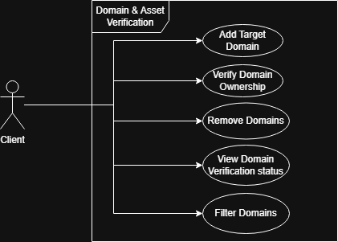
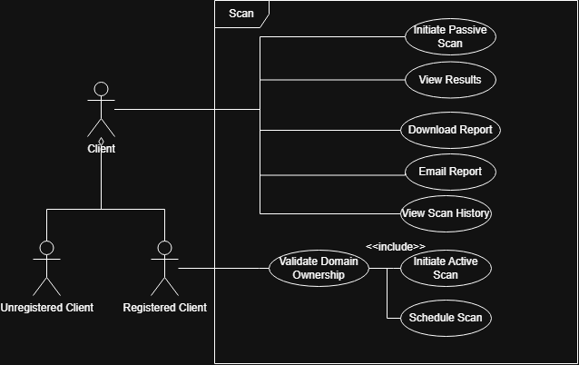
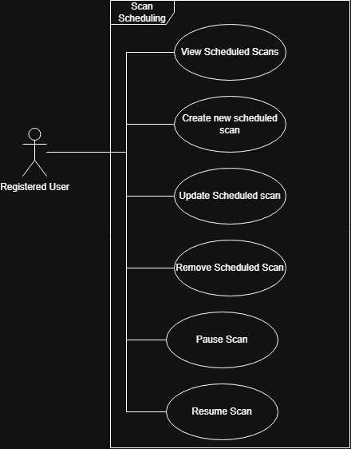
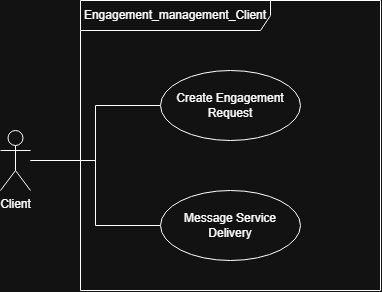
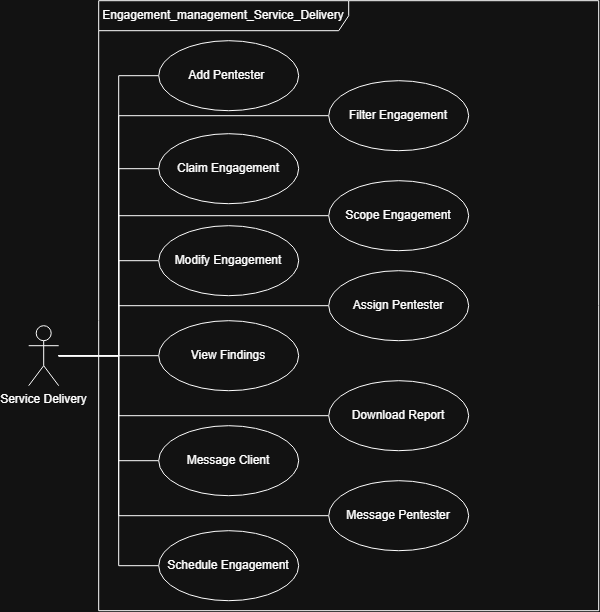
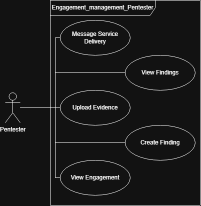

# Software Requirements Specification (SRS)

# PenFlow
## Team: The BroCode

## Functional Requirement

#### FR-1: Initiate CTEM Scan
* **FR-1.1:** The system shall allow any user (authenticated or anonymous) to submit a domain name for OSINT scanning without requiring account creation.
* **FR-1.2:** The system shall validate the submitted domain name format before accepting the scan request.
* **FR-1.3:** The system shall generate and return a unique `scan_id` upon successful scan submission.
* **FR-1.4:** The system shall return an initial scan status (e.g., queued, in_progress) upon submission.
* **FR-1.5:** The system shall display real-time scan progress inline on the landing page, updating without requiring a page reload.
* **FR-1.6:** The system shall implement IP-based rate limiting to prevent abuse (maximum 3 scans per IP per 10 minutes).
* **FR-1.7:** The system shall complete gracefully even if one or more OSINT data sources are unavailable, returning partial results where possible.
* **FR-1.8:** The system shall allow any user (authenticated or anonymous) to optionally provide an email address at the time of scan initiation, to receive the comprehensive scan report upon completion.

#### FR-2: View Scan Report
* **FR-2.1:** The system shall allow any user (authenticated or anonymous) to view a scan report using a valid `scan_id`.
* **FR-2.2:** The system shall display all findings associated with the scan, including asset information and risk indicators.
* **FR-2.3:** The system shall display a basic risk overview summarising the overall security posture of the scanned domain.
* **FR-2.4:** The system shall generate a publicly accessible URL for each scan report using its unique `scan_id`, accessible without authentication.
* **FR-2.5:** The system shall clearly indicate the scan status (e.g., in_progress, complete, failed) on the report view.
* **FR-2.6:** The system shall display the timestamp of when the scan was completed.
* **FR-2.7:** The system shall display a brief inline summary of scan findings directly on the results page, accessible to any user (authenticated or anonymous) without requiring a download or account creation.
* **FR-2.8:** The system shall deliver the comprehensive scan report via email to any user who provided an email address at scan initiation; authenticated users shall additionally be able to access and download the detailed report directly from the platform.

#### FR-3: Scan History
* **FR-3.1:** The system shall allow authenticated users to view a list of all scans they have previously initiated.
* **FR-3.2:** The system shall display the following information for each historical scan: `scan_id`, domain, status, and `created_at` timestamp.
* **FR-3.3:** The system shall restrict scan history access to the authenticated user who initiated the scans — users shall not be able to view other users' scan history.
* **FR-3.4:** The system shall display scan history in reverse chronological order (most recent first).
* **FR-3.5:** The system shall allow the user to navigate from a scan history entry directly to the corresponding scan report.
* **FR-3.6:** The system shall display scan history across both Phase 1 (CTEM) and
  Phase 2 (vulnerability) scans, with the scan type clearly indicated for each entry.
* **FR-3.7:** The system shall allow the user to filter scan history by scan type
  (Phase 1 / Phase 2) and by asset.

#### FR-4: User Authentication
* **FR-4.1:** The system shall allow users to register using an email address and password.
* **FR-4.2:** The system shall enforce password strength validation during registration. A valid password must be a minimum of 8 characters and contain at least one uppercase letter, one lowercase letter, one digit, and one special character.
* **FR-4.3:** The system shall allow registered users to log in and receive a signed JWT access token, which must be included in subsequent authenticated requests.
* **FR-4.4:** The system shall associate scans initiated while authenticated with the user's account.
* **FR-4.5:** The system shall allow unauthenticated users to initiate scans and view reports, with scan history only accessible after login.

#### FR-5: OSINT Data Collection
* **FR-5.1:** The system shall perform DNS record lookups on the submitted domain, including MX, TXT, SPF, and DMARC records.
* **FR-5.2:** The system shall enumerate subdomains associated with the submitted domain using certificate transparency logs (crt.sh).
* **FR-5.3:** The system shall check email addresses discovered during the scan against known data breach databases (HaveIBeenPwned) to identify credential exposures linked to the target domain.
* **FR-5.4:** The system shall perform a passive Shodan lookup to identify publicly indexed services and open ports associated with the domain.
* **FR-5.5:** The system shall identify technologies publicly visible on the domain using Wappalyzer, including web server software, CMS platforms, and web frameworks.
* **FR-5.6:** The system shall execute all OSINT lookups in parallel to minimise total scan time.
* **FR-5.7:** The system shall gracefully handle unavailable data sources, completing the scan with partial results rather than failing entirely.
* **FR-5.8:** The system shall use Hunter.io to identify publicly discoverable email addresses associated with the submitted domain, and shall classify each discovered address by type (personal or generic) and confidence score.

#### FR-6: Risk Assessment
* **FR-6.1:** The system shall assign a risk level to each finding discovered during the OSINT scan (Critical, High, Medium, Low, Informational).
* **FR-6.2:** The system shall calculate a risk summary for the scanned domain based on aggregated findings, including the total finding count broken down by severity level (Critical, High, Medium, Low, Informational).
* **FR-6.3:** The system shall provide a brief human-readable explanation for each finding, describing why it is considered a risk.
* **FR-6.4:** The system shall include actionable remediation recommendations for each identified finding.

#### FR-7: Audit Logging
* **FR-7.1:** The system shall log every scan initiation event, recording the domain, timestamp, and originating IP address.
* **FR-7.2:** The system shall log every report access event, recording the scan ID, timestamp, and whether the accessing user was authenticated or anonymous.
* **FR-7.3:** The system shall log every report download event, recording the user ID (if authenticated), scan ID, report type (brief or detailed), and timestamp.
* **FR-7.4:** The system shall store all audit logs in an append-only format. This shall be enforced by denying UPDATE and DELETE privileges on the `audit_logs` table at the database level.

### Phase 2

 #### FR-8: Domain Ownership Verification
  * **FR-8.1:** The system shall require that an asset's domain ownership is verified before
    a Phase 2 automated vulnerability scan can be initiated on that asset.
  * **FR-8.2:** The system shall allow authenticated users to initiate a domain ownership
    verification request for an asset registered to their account.
  * **FR-8.3:** The system shall generate a unique cryptographic token for each verification
    request and instruct the user to create a DNS TXT record at the root domain level
    (host `@`) with the record value set to the provided token.
  * **FR-8.4:** The system shall verify ownership by performing a DNS TXT record query
    (e.g. via `dig`/`nslookup`-equivalent resolution) against the root of the target domain
    and confirming that the issued token is present among the returned TXT values.
  * **FR-8.5:** The system shall allow the user to trigger a verification check on demand;
    the system performs a single DNS TXT lookup at that point and returns the result
    immediately, marking the request as failed if the token is not present.
  * **FR-8.6:** The system shall mark the asset as verified (`isVerified: true`, recording
    `verifiedAt`) upon successful token confirmation via DNS TXT lookup.
  * **FR-8.7:** The system shall record the most recent verification state against the asset,
    including the current status (pending, verified, failed), the method used (`dns_txt`),
    the issued token, and the timestamp of the last check. Only the latest state is retained;
    prior attempts are overwritten.

#### FR-9: Automated External Vulnerability Scan
 * **FR-9.1:** The system shall allow authenticated users to initiate a Phase 2 vulnerability
    scan only against assets whose domain ownership has been verified (FR-8.6).
* **FR-9.2:** The system shall restrict all Phase 2 scanning to the external perimeter only;
  no internal network scanning, authenticated web application testing, or social engineering
  simulation shall be performed.
* **FR-9.3:** The system shall enumerate open ports and identify service banners on the
  verified domain's external IP address.
* **FR-9.4:** The system shall assess the TLS/SSL configuration of the target domain,
  identifying weak cipher suites, expired certificates, and protocol downgrades.
* **FR-9.5:** The system shall evaluate HTTP security headers on the target domain and flag
  missing or misconfigured headers (e.g. HSTS, CSP, X-Frame-Options).
* **FR-9.6:** The system shall match discovered service versions against CVE feeds to
  identify known vulnerabilities, associating each match with its CVE ID and CVSS score.
* **FR-9.7:** The system shall assign a CVSS-aligned severity level (Critical, High, Medium,
  Low, Informational) to each finding produced by the Phase 2 scan.
* **FR-9.8:** The system shall provide actionable remediation guidance for each finding,
  including references to authoritative sources where applicable.
* **FR-9.9:** The system shall execute each Phase 2 scan inside an isolated Docker container,
    scoped to a single scan, to prevent cross-client data leakage and resource contention.
* **FR-9.10:** The system shall display real-time scan progress to the authenticated user
  who initiated the scan, updating without requiring a page reload.
* **FR-9.11:** The system shall complete gracefully if individual scan sub-tasks fail,
  returning partial results rather than failing the entire scan.

#### FR-10: Phase 2 Scan Results
* **FR-10.1:** The system shall display all Phase 2 findings grouped and filterable by
  severity level (Critical, High, Medium, Low, Informational).
* **FR-10.2:** The system shall generate a delta report for any Phase 2 scan where a
  previous scan exists for the same asset, highlighting new findings and resolved findings.
* **FR-10.3:** The system shall generate a downloadable PDF report for completed Phase 2
  scans, accessible only to authenticated users belonging to the asset's organisation.
* **FR-10.4:** The system shall display the CVE ID, CVSS score, description, and
  remediation guidance for each vulnerability-linked finding.

#### FR-11: Scan Scheduling
* **FR-11.1:** The system shall allow authenticated users to configure a recurring scan
  schedule for a verified asset, specifying a frequency (weekly or monthly).
* **FR-11.2:** The system shall automatically trigger a new Phase 2 scan at the configured
  interval without requiring manual user action.
* **FR-11.3:** The system shall allow authenticated users to view, update, and cancel an
  existing scan schedule for an asset they own.
* **FR-11.4:** The system shall record the `nextRun` and `lastRun` timestamps for each
  active schedule and update them after each triggered scan.
* **FR-11.5:** The system shall notify the asset owner when a scheduled scan completes,
  via an in-platform notification.

# PenFlow: Use Cases and User Stories

## User Stories

### US-01: As a PenFlow User, I want to initiate an OSINT scan on this domain so that I can discover potential vulnerabilities and exposed assets.

### US-02: As a PenFlow User, I want to view a summarized scan report so that I can quickly understand the risk level and asset impact of my target infrastructure.

### US-03: As a registered PenFlow User, I want to access my scan history so that I can track previous assessments and easily locate past reports.

### US-04: As a PenFlow User, I want to email the generated PDF report so that I can easily share the intelligence findings with my team or clients.

### US-05: As a PenFlow User, I want to securely authenticate and log in so that my sensitive scan data is protected and private.

### US-06: As a PenFlow User, I want to download my scan report as a PDF so I can store it offline or attach it to internal tickets.

### US-07: As a registered PenFlow user, I want to verify ownership of my domain via a DNS TXT record so that I can securely authorize active vulnerability scans on my infrastructure.

### US-08: As a PenFlow system, I need to isolate each active scan in a dedicated worker container so that cross client data leakage is prevented during execution.

### US-09: As a registered PenFlow user I want to receive a delta report after an active scan completes so that I can easily identify newly introduced or resolved findings.

### US-10: As a registered PenFlow user, I want to view a detailed history of a specific verified asset so that I can track how its security has changed over time.

### US-11: As a registered PenFlow user I want to view a high level summary so that I can quickly understand my organization's external risk score and prioritize critical remediations.

### US-12: As a registered PenFlow user, I want to add a new domain to my workspace so that I can begin the verification and scanning process.

### US-13: As a registered PenFlow user I want to view all my domains in a list so that I can easily manage and monitor the attack surface.

### US-14: As a registered PenFlow user I want to search and filter my domains so that I can quickly locate a specific target within a large list.

### US-15: As a registered PenFlow user I want to remove a domain from my account so that it is no longer tracked or scanned by the system.

### US-16: As a Client, I want to create an engagement request so that I can initiate a formal penetration test.

### US-17: As a Client, I want to message Service Delivery so that I can communicate about my engagement scope and progress.

### US-18: As Service Delivery, I want to filter and claim engagements so that I can take ownership of client requests.

### US-19: As Service Delivery, I want to scope and modify an engagement so that I can accurately define the technical boundaries and financial quote.

### US-20: As Service Delivery, I want to schedule engagements and assign pentesters so that the assessment has firm dates and allocated resources.

### US-21: As Service Delivery, I want to view findings and download reports so that I can perform QA before delivering them to the client.

### US-22: As a Pentester, I want to view my assigned engagements so that I can understand my assessment scope.

### US-23: As a Pentester, I want to create findings and upload evidence so that I can properly document discovered vulnerabilities.

### US-24: As a Pentester, I want to message Service Delivery so that I can ask questions or provide updates on the assessment.

### US-25: As a Registered User, I want to view, create, update, and remove scheduled scans so that I can easily manage my automated scanning frequency.

### US-26: As a Registered User, I want to pause and resume scheduled scans so that I can temporarily halt automated traffic during maintenance windows.

## Domain and Asset Verification

### UC: Add Domain
1. TUCBW: The user clicks "Add Domain" on the domain dashboard. 
2. TUCEW: The new domain is recorded in the system and ready for verification.

### UC: Verify Domain Ownership
1. TUCBW: The user adds a new domain and adds our verification token to the public DNS records. 
2. TUCEW: The domain is securely linked to the user's account and ready for Phase 2 scanning

### UC: View, Search and Filter Domain list
1. TUCBW: The user navigates to the Domains tab and types into the search bar or clicks on the filter button. 
2. TUCEW: The UI is updated to reflect the filtered criteria.

### UC: Remove Domain 
1. TUCBW: The user clicks the remove action on a specific domain.
2. TUCEW: The domain and its associated data are removed from the user's workspace. 

## Scans

### UC: Initiate OSINT Scan
1. TUCBW: The user inputs a domain and clicks scan.
2. TUCEW: A scan job is successful.

### UC: Execute Phase 2 Vulnerability Scan
1. TUCBW: After clicking a verified domain, the user clicks scan.
2. TUCEW: Raw vulnerability data is securely written and a formatted report is available for download

### UC: View Scan History and Target history
1. TUCBW: The user clicks on the history tab or navigates to a specific asset's history page.
2. TUCEW: UI successfully renders the historical timeline.

### UC: View, Download and Email Reports
1. TUCBW: The user clicks a report link downloads a PDF or submits an email address.
2. TUCEW: The user views the aggregated intelligence, downloads the PDF or dispatches it via email. 

## Schedule Scan

### UC: Manage Scheduled scans
1. TUCBW: A registered user navigates to a view where they can: create, update and remove scheduled scans, so they can manage scanning frequency.
2. TUCEW: The automated schedule is saved, updated or removed from the database.

### UC: Pause and resume scheduled scans
1. TUCBW: A registered user clicks to pause or resume an existing scan.
2. TUCEW: The scan's scheduled active state is successfully toggled. 

## Engagement management

### UC: Create Engagement Request
1. TUCBW: The client clicks to initiate a new engagement request
2. TUCEW: The engagement request is officially saved and queued for review.

### UC: Manage Engagement Scope and Schedule
1. TUCBW: Service delivery selects an engagement to claim, scope, modify or schedule.
2. TUCEW: The engagement is fully scoped, quoted and scheduled in the database.

### UC: Assign Pentester
1. TUCBW: Service Delivery clicks to assign a resource to a scheduled engagement. 
2. TUCEW: The engagement is linked to a specific Pentester

### UC: Documenting Findings and Evidence
1. TUCBW: The Pentester clicks to create a finding or upload evidence for their assigned engagement.
2. TUCEW: The finding and evidence are securely saved and available for review. 

### UC: Engagement Communication 
1. TUCBW: A client, service delivery or pentester initiates a message on an active engagement. 
2. TUCEW: The message is appended to the engagement's communication log.

### Domain Model

## Non-functional Requirements

### NFR-1: Performance
Our system's API endpoints respond to user requests within 2 seconds for 95% of requests under standard operating conditions. Futhermore due to the parallel execution of pur OSINT lookups, Phase 1 CTEM scans must complete and generate initial results within xx seconds.

### NFR-2: Secuirity
All user passwords and sensitive scan data must be encrypted at rest. Assitionally we enforce strict tenant isolation, all of our Phase 2, active scans, must be executed within isolated short-lived worker containers that are destroyed upon completion to prevent crossclient data leakage.

### NFR-3: Reliability
The core of our PenFlow web interface and user dashboard shall achieve 99% uptime. In the event of a third party OSINT API failure, our background worker processes must successfully recover within x seconds and gracefully compile a partial report, maintaining a 1% system crash rate.

### NFR-4: Scalability
The system's worker queue architecture must automatically support horizontal scaling, being able to handle an increase in workload of up to xxx% without requiring manual architectural changes and without experiencing more than xx% decrease in the speed of report generation.

### NFR-5: Maintainability
Our backend services and worker modules must maintain a minimum of 80% automated test coverage (all types of tests) to ensure reliable deployments. 