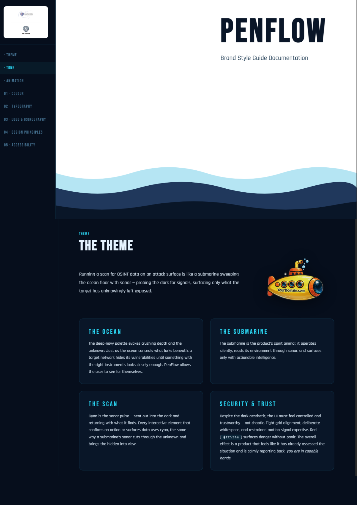
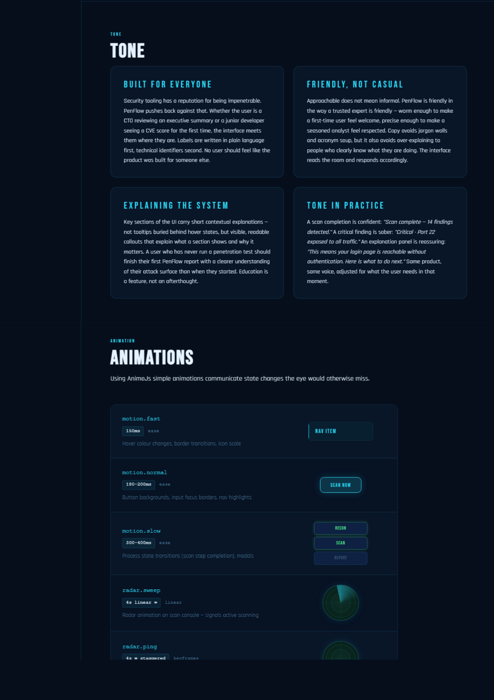
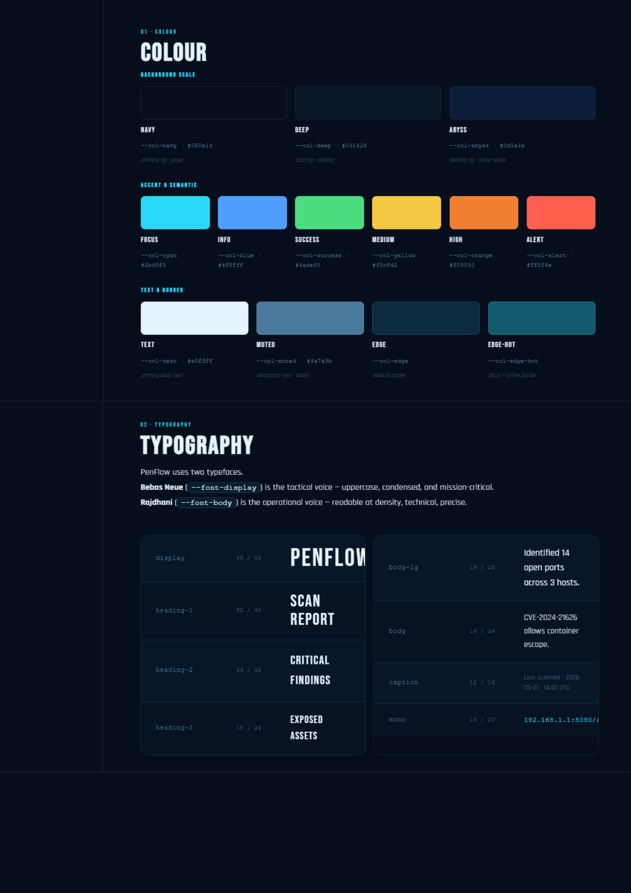
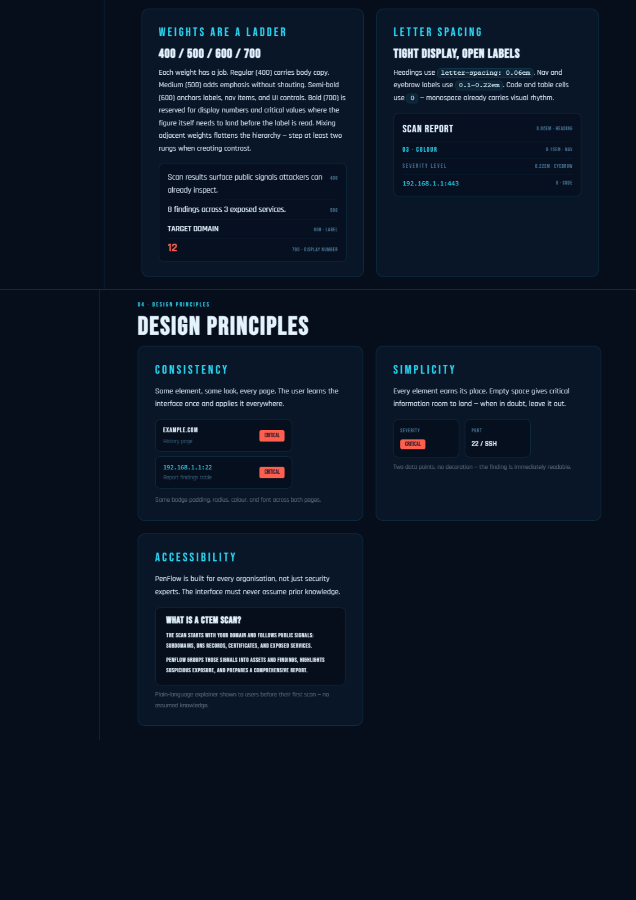
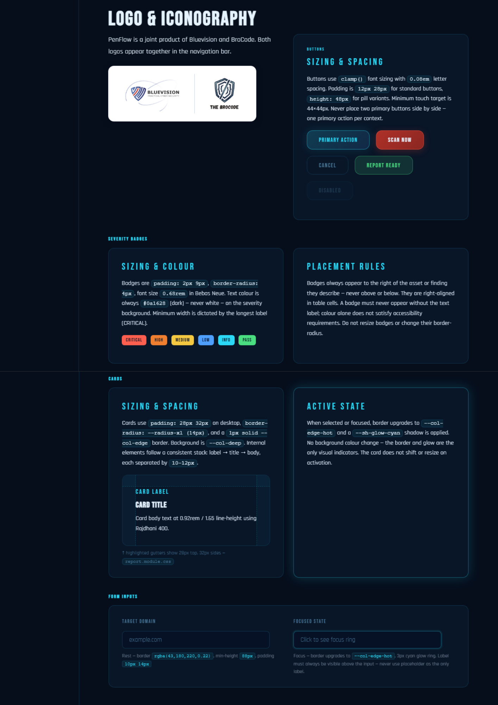
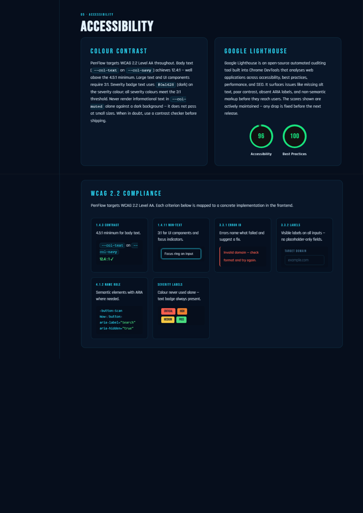
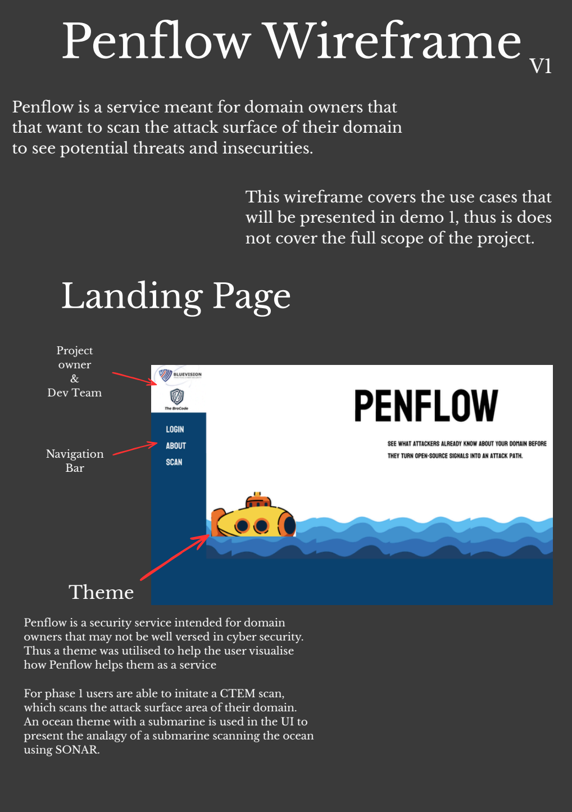
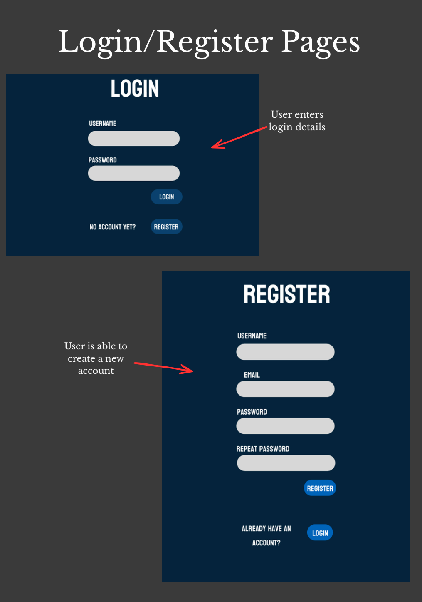

# PenFlow Design Documentation (Demo 1)

This document is the entry point for the PenFlow frontend Design documentation

## Quick Links

- Figma: [PenFlow Wireframe](https://www.figma.com/design/gigbxTUtCIFVGuLCAPadTc/Penflow-Wireframe?node-id=0-1&t=le59wRg1zwb1qQZd-1)
- PDF: [design_spec_doc.pdf](./design_spec_doc.pdf)
- Style Guide HTML: [brandstyle.html](./design/brandstyle.html)

# Design Specifications

# Wireframe

