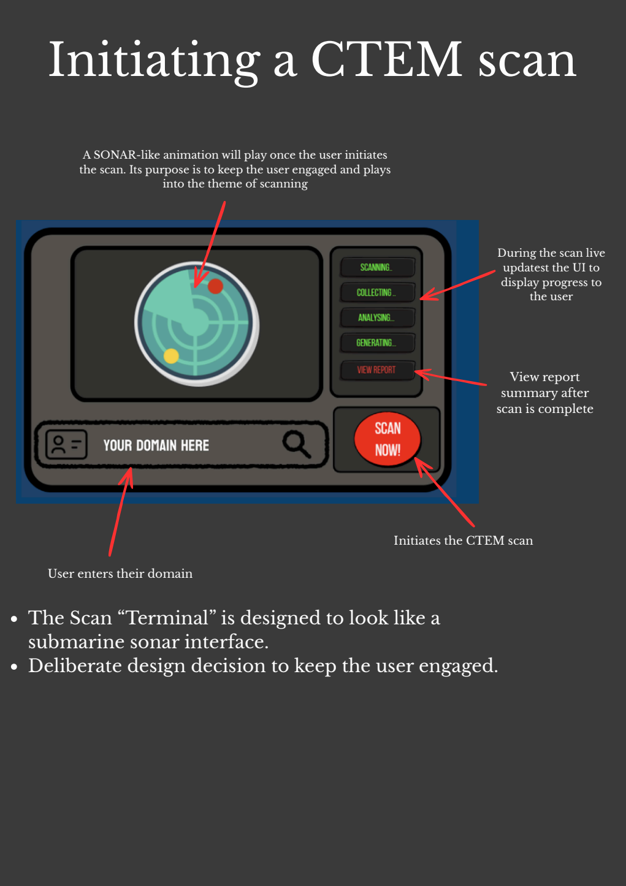
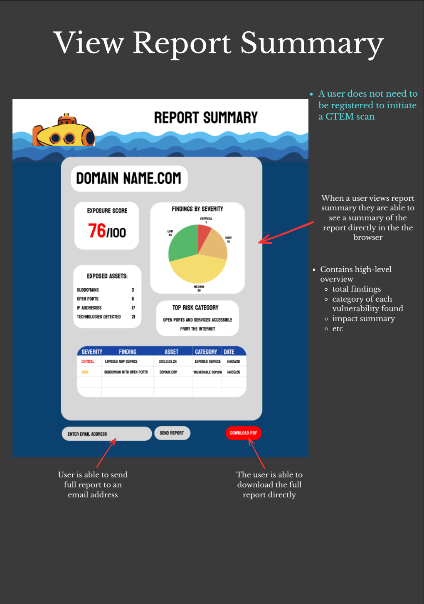
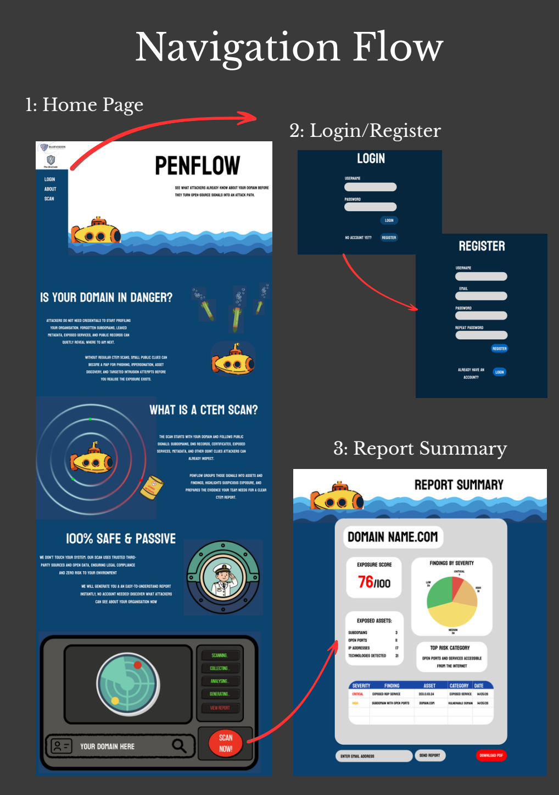

# PenFlow Wireframe Documentation (Demo 1)

This document is the entry point for the PenFlow frontend wireframe documentation.
View the pdf for detailed documentation

## Quick Links

- Figma (editable source): [PenFlow Wireframe](https://www.figma.com/design/gigbxTUtCIFVGuLCAPadTc/Penflow-Wireframe?node-id=0-1&t=le59wRg1zwb1qQZd-1)
- PDF (repo snapshot): [PenflowWireframeDoc.pdf](./PenflowWireframeDoc.pdf)

